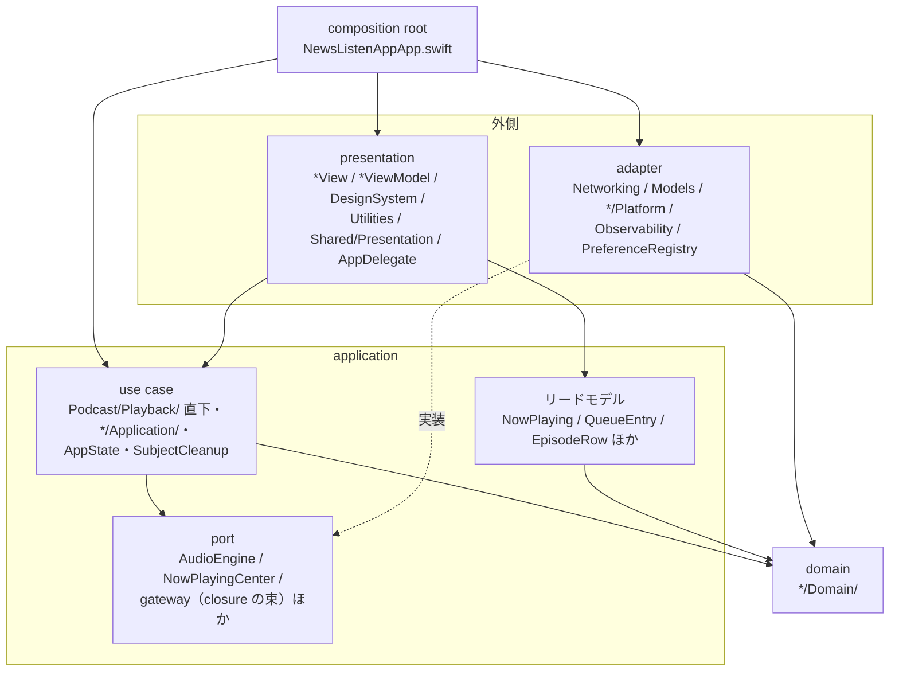
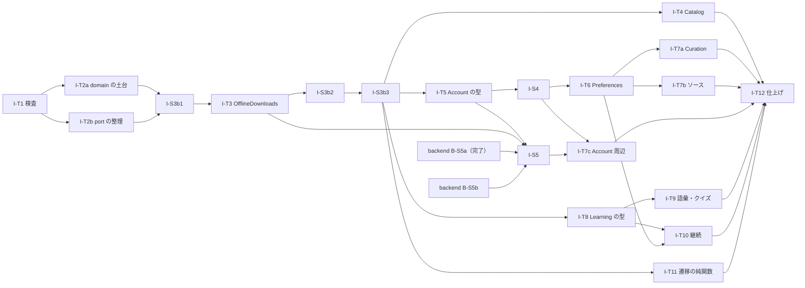

# news-listen-ios Implementation Spec — 目標アーキテクチャ（3 つのモデルの分離・層・command と query）

日付: 2026-09-30 ／ mode: design（read-only。実装は止めてある）／ owner: user ／ decision_maturity: **proposed**（本書を含む PR の承認で確定する）

## 1. 前書き

### 1.1 目的

iOS module の全 context について、リファクタの完了時の構造を実在の path に落とす。目的は user の指示（親 docs [ADR-110](../../../docs/adr/110-refactor-target-domain-centered-onion-cqrs.md)）の 2 点である。

1. ドメインモデル・リードモデル・データモデルが明確に分かれ、適切にカプセル化されている。
2. ドメインモデルを中心に置いた層構造と、command と query の分離による目的駆動の設計で、変更しやすい。

用語（層・3 つのモデル・変換の置き場・command と query・receipt・カプセル化の判定）と品質 scenario（AQ-1〜AQ-7）の定義は、親 docs [`design/architecture.md`](../../../docs/design/architecture.md) に従う。本書は定義を書き直さず、iOS の具体だけを書く。

### 1.2 既存の Spec との関係

| 文書 | 正本である範囲 |
|---|---|
| 本書 | 構造（層と path）、context ごとのモデルの対応、command と query の入口、依存の規則、検証の仕様、slice の全体と順序 |
| [`2026-09-16-implementation-spec-playback-domain-model.md`](2026-09-16-implementation-spec-playback-domain-model.md)（以下「再生 Spec」） | 再生・認証・設定・失敗の意味の範囲の、状態遷移と契約の詳細（§3.1〜§3.6 の表、契約 CI-T\*、テスト仕様 T-T\*） |

- 同じ契約を 2 つの文書に書かない。再生 Spec にある契約は ID（CI-T\*・§3.6.x・INV-P1）で参照する。
- 2 つが食い違うときは、構造・型の置き場・依存の向きは本書、状態遷移と契約の中身は再生 Spec が正しい。食い違う行は再生 Spec の本文を直し、その §9 改訂履歴に残す（2026-09-30 に直した行は §10.2）。
- 再生 Spec §3.6 の表（操作 × 状態、事象 × 状態、16 辺、Reporter の契機、`notice`、世代、表示形態、リモートコマンド）は変えない。本書が変えるのは、その表に現れる値の**型**と**置き場**だけである。

### 1.3 読む順

§3（層と path）→ §4（依存の規則）→ 担当する context の節（§5）→ §7（検証）→ §8（slice）。決定の一覧は §10。

### 1.4 状態と対象の revision

| 項目 | 内容 |
|---|---|
| 状態 | design。実装と takt への投入は止めてある（親 docs [refactor plan](../../../docs/plan/2026-09-16-design-review-refactor.md)「実装の停止と再開ゲート」） |
| ios | `ef9e559b0415c92fe8a61d89fa3a8f0d7262f0a9`（`main` の merge #98 と同じ commit）。production は `NewsListenApp/NewsListenApp/` の Swift 91 ファイル・12,058 行、テストは `NewsListenAppTests/` の 51 ファイル・`func test` 661 件 |
| 親 docs | ブランチ `docs/2026-09-30-refactor-target-architecture`（`design/architecture.md`・ADR-110 を含む作業ツリー） |
| 現状の記述 | 2026-09-30 に実コードを読んで確かめた。`path:行` は上の revision のもの。path は `NewsListenApp/NewsListenApp/` からの相対で書く |

### 1.5 ID の読み方

| 接頭辞 | 意味 |
|---|---|
| `TA-D<n>` | 依存の規則（§4） |
| `TA-M-<context>` | モデルの対応表（§5） |
| `TA-C-<context>-<n>` / `TA-Q-<context>-<n>` | command / query の入口（§5） |
| `TA-R-<context>-<n>` | 業務規則と、その依存先（§5） |
| `TA-V<n>` | 検証の仕様（§7） |
| `I-T<n>` | 本書で足す補完 slice（§8）。`I-S*` は既存の slice |
| `TP<n>` | 一時的に残す経路（§8.4）。TP1〜TP5 は再生 Spec §6 |
| `I-<n>` | 導出（§10.1）。I-1〜I-23 は親 docs 監査レポート §5.0。本書は I-24 以降の案を置く |

context の略号: `PB` 再生、`CT` Catalog、`AC` Account、`PF` Preferences、`CU` Curation（Feed / Starred）、`SO` RSS ソースと Onboarding、`LE` 学習の継続、`LV` 語彙、`LC` 理解度クイズ、`PU` Push、`OB` Observability、`PL` Platform。

## 2. 要求と trace の入口

本書が応える要求。対応の全体は §9。

| 種別 | ID | 本書での扱い |
|---|---|---|
| 品質要求 | PRD `NFR-09`（変更容易性）・`NFR-10`（カプセル化） | §3〜§7 の全体。受入条件は AQ-1〜AQ-7 |
| 品質 scenario | `architecture.md` §2 の AQ-1〜AQ-7 | §7 の TA-V1〜TA-V12 に 1 対多で対応 |
| 機能要求（再生） | `F-POD-01`・`F-POD-06`〜`F-POD-08`・`F-POD-10`、共有仕様 §2（Q-01〜Q-33）・§4.3（RS-01〜RS-07）・§4.4（PS-01〜PS-13・SL-01〜SL-10） | §5.1・§5.2。契約は再生 Spec |
| 機能要求（フィード・設定・アカウント） | `F-FEED-01`・`F-FEED-04`・`F-FEED-06`、`F-SET-01`・`F-SET-02`・`F-SET-04`・`F-SET-06`・`F-SET-08`、`F-ACC-01`〜`F-ACC-07`、`F-PKY-01`〜`F-PKY-03` | §5.3〜§5.6 |
| 機能要求（学習） | `F-LRN-01`・`F-LRN-02`・`F-LRN-04`〜`F-LRN-06`・`F-LRN-08`〜`F-LRN-11`、学習仕様 L-R01〜L-R21 | §5.7（L-R ごとの対応表つき）。台帳 SG-A5 の保留を iOS の分について解く |
| 決定 | ADR-101〜110、台帳の SG-\*（親 docs 監査レポート §5）、導出 I-1〜I-23（同 §5.0） | 再審議しない。目標に足りない分は移行の段階として残し、届く slice を §8 に書く |

iOS に実装が無い要求（`F-FEED-05`・`F-SET-03`・`F-LRN-03`・`F-LRN-07`、L-R03・L-R07・L-R08・L-R11〜L-R15・L-R20）は、受け皿になる context だけを §5.7.4 に書く。実装の slice は本書に置かない。

## 3. 層と実在の path

### 3.1 判定の単位

iOS アプリは Swift の module が 1 つで、`import` は module の単位である。同じ module の中の型は import なしで参照できるので、層の境界は import 文では判定できない。判定の単位を次のとおり定める。

- **所属表**: production の全 Swift ファイルを、path の規則で 5 つの層のどれか 1 つへ割り当てる表。テストコードが持つ（§7 の TA-V1）。表に当てはまらないファイルがあれば検査が落ちる。
- **型名の集合**: 「データモデルの型名」「adapter の具象の型名」など、規則が量化する型名の集合。所属表から機械的に作る（例: adapter の層のファイルで `Codable` / `Decodable` / `Encodable` に適合すると宣言された型の名前）。
- 規則の判定は「ある層のファイルに、ある型名・ある framework の import・ある構文が現れるか」で行う（§4）。コメント行（先頭の空白の後が `//`）は数えない。既存の `NewsListenAppTests/GrepOracleTests.swift` の `SourceGrep` と同じ数え方である。

所属表の規則（5 つの規則を**全部**評価する。順に当てて最初で止めない。どの規則にも当たらないファイルと、2 つ以上に当たるファイルがあれば TA-V1 が落ちる。混在ファイルと、規則に当たらないファイルは、完全一致の path の明示の行で層を決め、明示の行は規則の結果を上書きする。明示の行の初版は I-T1 の order）:

| 順 | path の規則 | 層 |
|---|---|---|
| 1 | `NewsListenAppApp.swift` | composition root |
| 2 | `**/Domain/**` | domain |
| 3 | `**/Application/**`、`Podcast/Playback/*.swift`（直下）、`AppState.swift`、`Auth/SubjectCleanup.swift` | application（use case・port の定義・リードモデルの型） |
| 4 | `Networking/**`、`Models/**`、`**/Platform/**`、`Observability/**`、`Settings/PreferenceRegistry.swift`、`Push/PushSupport.swift` | adapter（port の実装・データモデルと変換） |
| 5 | `*View.swift`・`*ViewModel.swift`・`*Sheet*.swift`・`*Card.swift`、`DesignSystem/**`、`Utilities/**`、`Shared/Presentation/**`、`Push/AppDelegate.swift`、`Feed/SafariView.swift` | presentation |

- ViewModel（`*ViewModel.swift`）は presentation である。画面の状態（読み込み中・文言・入力の下書き）を持ち、application の command と query を呼び、失敗の意味から文言を選ぶ。業務規則と通信の手順は持たない。
- リードモデルの型は application の層に置く。ファイルは所属表の `readModelFiles`（名前の一覧）に登録し、TA-D9 の検査の対象にする。
- port を定義するファイルは所属表の `portFiles` に登録し、TA-D11 の検査の対象にする。
- 現状の混在ファイル（複数の層の中身を持つファイル）は、そのファイルが目標で残る層に割り当て、その層の規則に反する行を許可リストに固定する（§7 の TA-V1）。

### 3.2 現状 → 目標の対応

「現状の層」は、2026-09-30 の実コードでの実際の役割である。

| 現状の置き場 | 現状の層と混在（`path:行`） | 目標の置き場 | 届く slice |
|---|---|---|---|
| `NewsListenAppApp.swift` | composition root ＋ presentation（`ContentView` が `PodcastViewModel` を作る `:136-145`、背景遷移で位置を送る `:193`、deep link の消費 `:205-213`） | そのまま。配線だけにする | I-S3b2・I-T12 |
| `AppState.swift`（557 行） | Account の application ＋ domain の型（`AuthSession` `:33-42`）＋ Preferences の状態（`:88-121`）＋ ストリーク（`:137,368-391`）＋ Onboarding（`:128,481-506`）＋ 通知の登録（`:260-284`）＋ deep link（`:144`）＋ adapter の既定生成（`:532-537`）＋ `APIClient` の生成（`:193-211`） | `AppState.swift` は Account の application だけ。ほかは各 context の application へ | I-T5・I-T6・I-T7b・I-T10・I-T12 |
| `Auth/SubjectCleanup.swift` | application。混在なし | そのまま | I-S5 で手順を足す |
| `Auth/LoginViewModel.swift`・`Auth/LoginView.swift` | presentation ＋ application（VM が `APIClient` を持つ `LoginViewModel.swift:25`） | presentation。login の use case は `Auth/Application/Authentication.swift` | I-T7c |
| `Models/*.swift`（13 本） | 通信のデータモデル ＋ 表示の規則（`Podcast.swift:153-191`）＋ 規則（`AuthModels.swift:24`・`LearningEngagement.swift:66-73`）＋ 実績カタログ（`LearningEngagement.swift:113-143`）＋ 永続化（`LearningEngagement.swift:146-165`）＋ 単語テストの状態機械（`VocabularyModels.swift:80-245`）＋ domain の値（`FeaturedCategory.swift`） | 通信のデータモデルと、domain / リードモデルへの変換だけ | I-T2a・I-T4・I-T5・I-T7a〜c・I-T8 |
| `Networking/APIClient.swift`・`APIEndpoint.swift` | adapter。失敗の意味型 `ApiFailure`・`NotFoundSubject` の宣言が同居（`APIClient.swift:23-43`） | adapter。`ApiFailure` は `Shared/Domain/ApiFailure.swift` へ | I-T2a |
| `Networking/FailureMessages.swift` | presentation（文言）が adapter の置き場にある | `Shared/Presentation/FailureMessages.swift` | I-T12 |
| `Networking/AudioCacheManager.swift`・`SessionStore.swift`・`NetworkMonitoring.swift`・`FileManagerProtocol.swift`・`Base64URL.swift` | adapter ＋ port の宣言（`SessionStore`・`NetworkMonitoring`）が同じファイル | adapter。port の宣言は使う側の application へ（`Auth/Application/SessionStore.swift`・`Shared/Application/Connectivity.swift`）。`AudioCacheManager.swift` は `Podcast/Platform/` へ | I-S5・I-T12 |
| `Podcast/Playback/AudioEngine.swift` | application（port と事象の値）。混在なし | そのまま | — |
| `Podcast/Platform/AVPlayerEngine.swift`・`MediaPlayerNowPlaying.swift` | adapter。閉じている | そのまま | — |
| `Podcast/Platform/NowPlayingCenter.swift` | port と値が adapter の置き場にある。`update(_ info: [String: Any])`（`:59`）が MediaPlayer の辞書の形を要求する | `Podcast/Playback/NowPlayingCenter.swift`。引数は `NowPlayingSnapshot` | I-T2b |
| `Podcast/NowPlayingInfo.swift` | adapter の補助が `Platform/` の外にある（`import AVFoundation`・`import MediaPlayer` `:12-13`） | `Podcast/Platform/NowPlayingInfo.swift` | I-T2b |
| `Podcast/PlaybackQueue.swift` | domain。要素が通信のデータモデル（`items: [Podcast]` `:17`） | `Podcast/Playback/Domain/PlaybackQueue.swift`。要素は `Episode` | I-T2a（移動と generic 化）・I-S3b2（production の要素が `Episode` になる） |
| `Podcast/PlaybackConstants.swift` | domain の値 | `Podcast/Playback/Domain/PlaybackConstants.swift` | I-T2a |
| `Podcast/PlaybackLifecycle.swift`・`PlayerPresentation.swift` | application（port・Coordinator が持つ状態の型） | `Podcast/Playback/` の直下 | I-T2b |
| `Podcast/TranscriptTiming.swift` | domain の規則と差し替え点。入力が通信のデータモデル（`:20,37`） | `Catalog/Domain/TranscriptTiming.swift`。入力は `EpisodeContent` | I-T2a |
| `Podcast/PodcastViewModel.swift`（698 行） | presentation ＋ application ＋ 規則（一覧 `:140`、ダウンロード `:190-226`、再生 `:264-338`、完聴 `:396-426`、位置同期 `:643-680`、`UIApplication` `:417-420`、学習の中継 `:460-472`、末尾 2 秒 `:309-313`） | presentation（facade）。中身は `Podcast/Playback/`・`Catalog/Application/`・`Learning/Application/` へ | I-S3b1〜I-S3b3・I-T3・I-T4・I-T9 |
| `Podcast/*View.swift`・`QueueSheet.swift`・`QuizSheetView.swift` | presentation ＋ 規則（§5 の TA-R） | presentation | I-S3b2・I-S3b3・I-T4・I-T9 |
| `Feed/`・`Starred/` | presentation ＋ application（VM が `APIClient` と通信のデータモデル `Article` を持つ。楽観更新と取り消し `FeedViewModel.swift:147-237`） | presentation ＋ `Feed/Domain/`・`Feed/Application/` | I-T7a |
| `Learning/` | presentation ＋ application（query の中で既読を書く `LearningViewModel.swift:33`。VM が `UIAccessibility` と `DSFeedback` を呼ぶ `VocabularyTestViewModel.swift:39-49`） | presentation ＋ `Learning/Domain/`・`Learning/Application/` | I-T8〜I-T10 |
| `Settings/PreferenceRegistry.swift` | domain の宣言（key・scope・主体依存・値域・既定値）＋ adapter（`UserDefaults` `:73`） | adapter（`UserDefaults` の読み書き）。値域と既定値は `Settings/Domain/` | I-T6 |
| `Settings/SettingsViewModel.swift`・`SettingsView.swift`・`AccountSettingsView.swift` | presentation ＋ application ＋ 規則（View が gateway を直接呼ぶ `AccountSettingsView.swift:311,327`。View に同期と巻き戻し `SettingsView.swift:106-121,375-386,398-409`。`@AppStorage` `SettingsView.swift:20-21`） | presentation ＋ `Settings/Application/` | I-S4・I-T6・I-T7b・I-T7c |
| `Sessions/`・`Admin/`・`Onboarding/`・`Passkey/` の VM | presentation ＋ application ＋ 通信のデータモデル（`Sessions/SessionModels.swift`・`Passkey/PasskeyModels.swift` の `Codable` 6 個） | presentation ＋ 各 `Application/`。通信のデータモデルは `Models/` へ。`Passkey/` の port は `Passkey/Application/`、OS の実装と変換は `Passkey/Platform/` | I-T7b・I-T7c |
| `Push/AppDelegate.swift`・`PushSupport.swift` | OS の入口 ＋ 純関数。`AppState` を直接呼ぶ（`AppDelegate.swift:54,86,98,102`） | `AppDelegate.swift` は presentation（OS の入口）、`PushSupport.swift` は adapter。呼び先は `Push/Application/PushRegistration.swift` | I-T12 |
| `Observability/` | adapter ＋ 通信のデータモデル。`APIClient` を自分で作る（`CrashReporter.swift:100`） | adapter。`APIClient` は合成 root から受ける | I-T12 |
| `DesignSystem/` | presentation。`DSFeedback` が `@AppStorage` を使う（`DSFeedback.swift:31-32`）。`DSStreakToolbar` が `AppState` と表示条件を持つ（`Components/DSStreakToolbar.swift:11,17-19`）。`PreviewSupport` が VM の状態を書く（`:153-157,165`） | presentation | I-S3b2・I-T6・I-T10 |
| `Utilities/DifficultyLabel.swift` | 難易度の値域（`:14`）＋ 表示ラベル | 値域は `Shared/Domain/DifficultyLevel.swift`。ラベルは presentation に残す | I-T6 |
| `Utilities/` のほか 3 本 | presentation | そのまま | — |

新しく作るディレクトリ: `Shared/Domain/`・`Shared/Application/`・`Shared/Presentation/`、`Catalog/Domain/`・`Catalog/Application/`、`Podcast/Playback/Domain/`、`Auth/Domain/`・`Auth/Application/`、`Settings/Domain/`・`Settings/Application/`、`Feed/Domain/`・`Feed/Application/`、`Learning/Domain/`・`Learning/Application/`、`Sessions/Application/`、`Admin/Application/`、`Passkey/Application/`・`Passkey/Platform/`、`Onboarding/Application/`、`Push/Application/`。Xcode プロジェクトは synchronized group なので、ファイルの追加と移動で `project.pbxproj` は変わらない。

### 3.3 層の関係（iOS）



## 4. 依存の規則

量化する集合は所属表（§3.1）から作る。「現状の違反」は 2026-09-30 の実測で、所属表の初版（I-T1 の時点。混在ファイルを §3.1 の最後の項のとおり割り当てたもの）での値である。実測に使った集計は §11 に記す。

**型名の集合**

| 名前 | 作り方 | 2026-09-30 の中身 |
|---|---|---|
| `DTO` | adapter の層のファイルで、`Codable` / `Decodable` / `Encodable` に適合すると宣言された型の名前。葉の値型 4 つ（`TranscriptSegment`・`VocabularyEntry`・`QuizQuestion`・`PodcastSourceArticle`）は I-T2a で domain へ移すので、移した後は集合に入らない | 43 個（`Models/` 36、`Passkey/PasskeyModels.swift` 3、`Sessions/SessionModels.swift` 3、`Observability/ClientErrorPayload.swift` 1） |
| `AdapterConcrete` | `APIClient`・`KeychainSessionStore`・`AudioCacheManager`・`MediaPlayerNowPlaying`・`AVPlayerEngine`・`NetworkMonitor`・`PreferenceRegistry`・`CrashReporter`・`ASAuthorizationPasskeyProvider` | 9 個 |
| `UIFacility` | `DSFeedback`・`UIApplication`・`UIAccessibility`・`Timer`・`UserDefaults`・`@AppStorage` | 6 個 |
| View ファイル | presentation の層で、`import SwiftUI` を持ち、名前が `*ViewModel.swift` でないファイル | 28 本（合成 root の `NewsListenAppApp.swift` を含めると 29 本） |
| ViewModel ファイル | presentation の層の `*ViewModel.swift` | 13 本 |

**規則**

| ID | 規則（機械的な判定の形） | 量化する集合 | 現状の違反 | 0 にする slice |
|---|---|---|---|---|
| TA-D1 | domain のファイルは `Foundation` 以外を import しない。`Codable`・`Decodable`・`Encodable`・`CodingKey`・`UserDefaults`・`ObservableObject`・`@Published`・`URLSession`・`FileManager`・`AdapterConcrete` の型名を書かない | domain の全ファイル（初版は 4 本: `Podcast/PlaybackQueue.swift`・`Podcast/PlaybackConstants.swift`・`Podcast/TranscriptTiming.swift`・`Models/FeaturedCategory.swift`） | 0 | 最初から 0。domain が増えるたびに対象が増える |
| TA-D2 | domain のファイルに `DTO` の型名が現れない | 同上 × `DTO` | 14 行 / 3 ファイル（`Podcast/PlaybackQueue.swift` 10、`Podcast/TranscriptTiming.swift` 2、`Models/FeaturedCategory.swift` 2） | I-T2a（再生と Catalog）・I-T7b（`FeaturedCategory`） |
| TA-D3 | application のファイルは `Foundation`・`Combine`・`os` 以外を import しない。`AdapterConcrete`・`UIFacility`・`DTO` の型名を書かない | application の全ファイル（初版は 7 本: `AppState.swift`・`Auth/SubjectCleanup.swift`・`Podcast/Playback/AudioEngine.swift`・`Podcast/PlaybackLifecycle.swift`・`Podcast/PlayerPresentation.swift`・`Podcast/Platform/NowPlayingCenter.swift`・`Passkey/PasskeyAuthorizationProviding.swift`） | `AppState.swift` に `AdapterConcrete` / `UIFacility` 10 行、`DTO` 5 行 | I-T5・I-T6・I-T10・I-T12 |
| TA-D4 | View ファイルは `APIClient`・`ApiFailure`・`UserDefaults`・`@AppStorage`・`DTO` の型名を書かない | View ファイル 28 本 | `APIClient` 14 行 / 9 ファイル（合成 root の 2 行は対象外）。`ApiFailure` 2 行（`Settings/AccountSettingsView.swift:331`・`Podcast/QuizSheetView.swift:199`）。`@AppStorage` 4 行（`Settings/SettingsView.swift:20-21`・`DesignSystem/DSFeedback.swift:31-32`）。`DTO` 59 行 / 16 ファイル | I-S3b3・I-S4・I-T4・I-T6・I-T7a〜c・I-T9・I-T10 |
| TA-D5 | View ファイルは、ViewModel と application の状態へ代入しない。パターン: `viewModel`・`vm`・`appState`・`<名前>ViewModel` のどれかに続く `.<プロパティ> = `（`==` を除く）と `.toggle()` | View ファイル 28 本と合成 root | 18 行 / 5 ファイル ＋ 合成 root 1 行（`viewModel.errorMessage = nil` 8、`appState.<主体依存値> = oldValue` 3、`viewModel.isSelectionMode.toggle()` 1、Preview の 6、`appState.selectedPodcastId = nil` 1） | I-S3b2（`Podcast/` と Preview の 8）・I-T6・I-T7a・I-T7b・I-T12 |
| TA-D6 | ViewModel ファイルは `APIClient`・`AdapterConcrete`・`UIFacility`・`DTO` の型名を書かず、`UIKit`・`SwiftUI` を import しない | ViewModel ファイル 13 本 | `APIClient` 28 行 / 13 ファイル。`AdapterConcrete` / `UIFacility` / import 20 行 / 6 ファイル。`DTO` 38 行 / 11 ファイル | I-S3b2・I-S3b3・I-T3・I-T4・I-T7a〜c・I-T9・I-T10 |
| TA-D7 | adapter のファイルは `*ViewModel`・`AppState` の型名を書かず、`SwiftUI` を import しない | adapter の全ファイル（初版 31 本） | 0 | 最初から 0 |
| TA-D8 | `Codable`・`Decodable`・`Encodable`・`CodingKey`・`JSONDecoder`・`JSONEncoder` は adapter のファイルにだけ現れる | adapter 以外の全ファイル | 3 行 / 2 ファイル（`DesignSystem/PreviewSupport.swift` 2、`Podcast/QuizSheetView.swift` 1。どちらも Preview の fixture） | I-S3b2・I-T9 |
| TA-D9 | リードモデルのファイルに、`class`・`actor`・`@Published`・`mutating`・格納プロパティの `var`（computed を除く）が無い。プロパティの型に `DTO` と参照型（`ObservableObject` に適合する型）が無い | 所属表の `readModelFiles` | 対象 0 本（リードモデルの型がまだ無い）。I-S3b1 で `Podcast/Playback/NowPlaying.swift` が入った時点から、集合が空でないことも検査する | 最初から 0 |
| TA-D10 | production の全 Swift ファイルが、所属表のちょうど 1 つの層に当たる | 91 本 | 0 | 最初から 0 |
| TA-D11 | port を定義するファイルの宣言に、`DTO`・framework の型（`AV*`・`MP*`・`UI*`・`URLRequest`・`HTTPURLResponse`）・`[String: Any]` が現れない | 所属表の `portFiles`（初版: `Podcast/Playback/AudioEngine.swift`・`Podcast/Platform/NowPlayingCenter.swift`・`Podcast/PlaybackLifecycle.swift`・`Passkey/PasskeyAuthorizationProviding.swift`） | 1 行（`Podcast/Platform/NowPlayingCenter.swift:59` の `[String: Any]`） | I-T2b |
| TA-D12 | application のファイルに、`private(set)` の無い `@Published var` が無い。ViewModel ファイルの `private(set)` の無い `@Published var` は、入力の下書きの許可リストに載ったものだけである | application の全ファイルと ViewModel ファイル 13 本 | 48 個（`AppState.swift` 10、ViewModel 38）。目標は application 0・ViewModel 6（下の表） | I-S3b2・I-S3b3・I-T6・I-T7a〜c・I-T10・I-T12 |
| TA-D13 | `AdapterConcrete` の生成（`<型名>(`）は合成 root と、`#if DEBUG` または `#Preview` の中にだけある | 合成 root 以外の全ファイル | 16 行（2026-10-01 に数え直した。下の列挙に `ASAuthorizationPasskeyProvider()` の 2 行 `Auth/AccountSettingsView.swift:42`・`Auth/LoginView.swift:28` を足す。I-T1 の実測が正）（`AppState.swift:203,532,535,536,537`、`Podcast/PodcastViewModel.swift:115,116,118,119`、`Settings/SettingsViewModel.swift:73,80`、`Feed/FeedViewModel.swift:78`、`Starred/StarredViewModel.swift:46`、`Observability/CrashReporter.swift:100`）。Preview の 5 行（`Learning/LearningView.swift:301,308`・`Learning/VocabularyTestView.swift:279,287`・`DesignSystem/PreviewSupport.swift:142`）は `#if DEBUG` の中にあり、違反に数えない | I-S3b2・I-S3b3・I-T7a・I-T12 |
| TA-D14 | 既存の検査（`GrepOracleTests` の O-1〜O-13・G01〜G05・G08、`ci.yml:47` の `statusCode ==` / `httpError(`）を保つ。期待値を変えるのは、slice の表（§8）が明記したときだけ | 既存のとおり | 0 | — |

**TA-D12 の許可リスト（恒久。入力の下書き）**: `LoginViewModel.username`・`LoginViewModel.password`（`Auth/LoginViewModel.swift:16,18`）、`AdminUsersViewModel.newUsername`・`newPassword`・`newDisplayName`・`newRole`（`Admin/AdminUsersViewModel.swift:20-23`）の 6 個。View が `$viewModel.<名前>` で双方向に束ねる編集中の値で、ドメインの状態でもリードモデルでもない。これ以外の 42 個は `private(set)` にするか、computed へ置き換える。`$appState.<設定>` で束ねている 5 個（`Settings/SettingsView.swift` の Picker）は、`Binding(get:set:)` で query と command に分ける（§5.5）。

許可する依存は `architecture.md` §3 の表のとおり。iOS で補う点は 2 つある。

- presentation は domain の値型を読んで表示してよい（例: `PlaybackState` を `switch` して表示を選ぶ）。domain の状態を変える関数は呼ばず、command を通す。
- composition root だけが全部の層を参照する。`ContentView`（`NewsListenAppApp.swift` の中）も composition root に含める。

## 5. context ごとの構造

各節は同じ形で書く: 目的 → モデルの対応（`TA-M`）→ command と query（`TA-C` / `TA-Q`）→ 規則と依存先（`TA-R`）→ port と adapter → 整合性と失敗 → 現状 / 移行中 / 目標。

全 context に共通の決まり:

- **gateway の port**: application は、通信を closure の束（`struct`。`let` の closure だけを持つ）として受ける。closure の引数と戻り値は domain かリードモデルの型で、失敗は `ApiFailure` を投げる。束は application の層で宣言し（`portFiles` に登録）、`APIClient` から束を組み立てる関数は adapter の層（`Networking/Gateways/<context>Gateway+Live.swift`）に置く。protocol は増やさない（再生 Spec §5 の abstraction gate を保つ）。Coordinator と Reporter は既決のとおり closure を 1 つずつ受ける。
- **通信のデータモデル → domain / リードモデルの変換**は、`Models/<DTO>+<目標の型>.swift` の extension に置く（`architecture.md` §4.2 の 1 行目と 4 行目）。
- **テスト**: application のテストは、束を `APIClient`（`MockURLSession` つき）から組み立てて渡す形を基本にし、本番の経路を通す（再生 Spec §7 の R7 を保つ）。規則だけを確かめるテストは closure を直接差し替える。
- **command の戻り値**: 失敗は `throws`（`ApiFailure` か、その context の失敗の意味）。成功は何も返さないか、receipt を返す。表の「結果」に receipt の中身を書く。

### 5.1 Playback（`PB`）— 聴き続ける

**目的と、誰のためか**: Listener が、移動中・オフラインでも音声を途切れず聴き、前回の続きから再開し、ロック画面とイヤホンから操作する（再生 Spec §1.2 の UC-P1〜P6・UC-S1・UC-S2）。

#### TA-M-PB モデルの対応

| モデル | 型 | 目標の置き場 | 現状 | 届く slice |
|---|---|---|---|---|
| domain | `PlaybackState`（7 状態）・`PlaybackErrorReason`・`InterruptionPhase` | `Podcast/Playback/Domain/PlaybackState.swift` | 型が無い。`Podcast/PodcastViewModel.swift:40-51,63` の `@Published` の組合せ | I-S3b1 |
| domain | `PlaybackQueue<Item>`（順序と現在位置。production の要素は `Episode`） | `Podcast/Playback/Domain/PlaybackQueue.swift` | `Podcast/PlaybackQueue.swift:17`（要素は通信のデータモデル `Podcast`） | I-T2a（generic 化と移動）・I-S3b2（要素が `Episode` だけになる） |
| domain | `PlaybackConstants`（速度 8 段・スキップ秒）、`PlaybackRules`（`resolvePlaybackSource`・`resolveResumePosition`・位置の丸め・「engine が読み込み済みである状態」の判定） | `Podcast/Playback/Domain/` | 速度は `Podcast/PlaybackConstants.swift:15`。再開位置は `PodcastViewModel.swift:309-313`、再生元は `:240-251`、丸めは `:599,602` と `Podcast/AudioPlayerView.swift:204,225` | I-T2a・I-S3b1 |
| domain | 遷移の決定（再生 Spec §3.6.2・§3.6.3 の表を、状態と入力から「次の状態・engine への指示・通知」を返す純関数にしたもの） | `Podcast/Playback/Domain/PlaybackTransition.swift` | 無い | I-S3b1 では `PlaybackSession` が持つ（TP8）。I-T11 で取り出す |
| application | `PlaybackSession`・`SessionEvent`・`PlaybackCoordinator`・`PlaybackNotice`・`PositionReporter`・`PlayerPresentation`・`OfflineLibrary`・`OfflineDownloads` | `Podcast/Playback/` の直下 | `PodcastViewModel.swift` に混在 | I-S3b1・I-T3 |
| リードモデル | `NowPlaying`・`QueueEntry`（下の表）、`NowPlayingSnapshot`（ロック画面へ渡す値）、`DownloadState`（`notDownloaded / downloading / downloaded`） | `Podcast/Playback/NowPlaying.swift`・`Podcast/Playback/NowPlayingCenter.swift`・`Podcast/Playback/OfflineDownloads.swift` | 無い。View は `currentPodcast`（通信のデータモデル）と atom を読む。ロック画面は辞書（`Podcast/NowPlayingInfo.swift:28-45`）。`DownloadState` は `PodcastViewModel.swift:15-22` | I-T2b・I-S3b1・I-T3 |
| データモデル（永続化） | 音声ファイル `Caches/NewsListenApp/audio-cache/{id}.mp3`（I-S5 の後は `audio/{user_id}/{id}.mp3`）。位置の端末の記録は無い（ADR-109 の分は未起票の位置同期 slice） | `Podcast/Platform/AudioCacheManager.swift` | `Networking/AudioCacheManager.swift` | I-S5 |
| データモデル（通信） | `Podcast`、位置の書込の body | `Models/Podcast.swift`・`Networking/APIClient.swift:143-147` | 同左 | そのまま |
| 変換 | `Podcast.toEpisode()`（通信 → domain）／`Episode` → `NowPlaying`・`QueueEntry`（query）／`NowPlayingSnapshot` → MediaPlayer の辞書（adapter） | `Models/Podcast+Episode.swift`／`PlaybackCoordinator`／`Podcast/Platform/NowPlayingInfo.swift` | 変換が無い。通信のデータモデルが、キューの正本・再生の引数・ロック画面の材料を兼ねる | I-T2a・I-T2b・I-S3b1 |

**リードモデルの形**（どれも `struct`・`let` だけ。`Equatable`）

| 型 | field | 元と、現行の表示との対応 |
|---|---|---|
| `NowPlaying` | 共通 7（`episodeId`・`displayTitle`・`japaneseIntroText`・`segments`・`vocabulary`・`quiz`・`difficulty`）＋ iOS 固有 2（`sourceArticles`・`sourceKind`）。SG-C11・C14 のまま | `queue.current` の `Episode` の `content` から作る（再生 Spec §3.1）。`session` が `idle` なら無し |
| `NowPlaying` の導出値（field に数えない。6 つ） | `hasTranscript`・`hasVocabulary`・`hasQuiz`・`hasSourceArticles`・`showsCcBySaLicense`（`Bool`）、`queueEntry`（`QueueEntry`） | 5 つの `Bool` は `EpisodeContent` の規則（TA-R-CT-3）の結果を query が写す。`queueEntry` は同じエピソードの待機列の行としての形。導出 I-26 |
| `QueueEntry` | `episodeId`・`introText`・`difficulty`・`durationSeconds` | 現行の行が読む 3 つ（`Podcast/QueueSheet.swift:71,75`: 日本語イントロ、難易度のコード、`m:ss` に整形する総時間）。`m:ss` への整形は presentation。総時間はサーバーの値（`EpisodeContent.durationSeconds`）で、engine の値では置き換えない |
| `NowPlayingSnapshot` | `title`・`subtitle`・`elapsed`・`duration`・`rate`・`isPlaying` | `NowPlayingInfo.make` の引数と同じ意味（`Podcast/NowPlayingInfo.swift:28-45`）。`subtitle` は難易度の表示ラベルで、合成 root が渡す closure（難易度のコード → ラベル）で作る |

#### TA-C-PB / TA-Q-PB

Coordinator の公開 19 操作（SG-C60）は数も意味も変えない。入口と戻り値の型だけを置き換える。

| ID | 入口 | 入力 | 結果 | 今の公開操作 |
|---|---|---|---|---|
| TA-C-PB-1 | `startEpisode(_:expandsPlayer:)` | `Episode` | なし。開始前に再生できなければ `notice` に理由（SG-C62） | `PodcastViewModel.playNow` / `play`（`:264,477`） |
| TA-C-PB-2 | `startEpisode(id:)` | エピソードの id | なし。解決の失敗は受けた error をそのまま投げる | `playById`（`:339`） |
| TA-C-PB-3〜5 | `replayCurrent()`・`retry()`・`togglePlayPause()` | — | なし | `replayCurrentEpisode`（`:442`）・（新規）・`togglePlayPause`（`:514`） |
| TA-C-PB-6・7 | `seek(to:)`・`setSpeed(_:)` | 秒・速度 | なし | `:528,536` |
| TA-C-PB-8・9 | `addToQueue(_:)`・`playNext(_:)` | `Episode` | なし | `:486,495` |
| TA-C-PB-10〜12 | `removeFromQueue(id:)`・`moveUpNext(fromOffsets:toOffset:)`・`skipToNext()` | — | なし | `:504,509`・（新規） |
| TA-C-PB-13〜16 | `dismissError()`・`stopForLogout()`・`minimizePlayer()`・`expandPlayer()` | — | なし | View の `errorMessage = nil`・`:691,429,435` |
| TA-C-PB-17 | `PositionReporter.flush()`（背景遷移の入口。facade の `flushPosition()` が中継する） | — | なし。送る状態でなければ何もしない | `flushPlaybackPosition`（`:659`） |
| TA-Q-PB-1 | `nowPlaying()` | — | `NowPlaying?` | `currentPodcast`（`:40`） |
| TA-Q-PB-2 | `upNext()` | — | `[QueueEntry]` | `queue.upNext`（View が直接読む。`Podcast/QueueSheet.swift:29,34`） |
| TA-Q-PB-3 | 公開する状態 5 つ: `session`（`PlaybackState`）・`presentation`・`queue`・`notice`・`isAdvancing` | — | 値（`@Published private(set)`） | `isPlaying` ほか 9 個の `@Published var`（`:40-51`） |
| TA-C-PB-20 | `OfflineDownloads.download(episodeId:)` | id | receipt = `saved` / `alreadySaved` / `alreadyRunning`。失敗は `ApiFailure`・`invalidSource`・保存の失敗 | `download(podcast:)`（`:190`） |
| TA-C-PB-21 | `OfflineDownloads.remove(episodeId:)`・`removeAll()` | id | なし。失敗は保存の失敗 | `removeDownload`（`:219`）・`SettingsViewModel.clearCache`（`Settings/SettingsViewModel.swift:196`） |
| TA-C-PB-22 | `OfflineDownloads.cancelAll()` | — | なし。完了を待たない（ADR-104 決定 9） | 無い（I-S5 で入る） |
| TA-Q-PB-4 | `OfflineDownloads.state(for:)`・`OfflineLibrary.savedIds`・`OfflineLibrary.usage()` | id | `DownloadState`・`Set<String>`・`Int64` | `downloadState(for:)`（`:162`）・`downloadedIds`・`SettingsViewModel.loadCacheSize`（`:190`） |

- `queue` は TA-Q-PB-3 の状態として公開するが、View は読まない（I-S3b3 の完了条件 2 のまま）。値型なので、外で得た写しを変えても Coordinator の状態は変わらない。
- `startEpisode` が `Episode` を受けるので、呼ぶ側（facade）は id から `Episode` を引く。引く先は Catalog の query（TA-Q-CT-2）。I-T4 までの間は TP6（§8.4）。
- `OfflineLibrary` は再生 Spec §3.1 の 8 操作（I-10）のまま、`Podcast/Playback/` に置く。受け取るのは `AudioCacheManager` の具象ではなく、ファイルの保存を表す port（下）である。

#### TA-R-PB 規則と、その依存先

| ID | 規則 | 正本（目標） | 今どこに居るか | 意味を変えたときの依存先 |
|---|---|---|---|---|
| TA-R-PB-1 | 状態は 7 つの union で、16 辺以外は起きない。表の外の操作は `stop` と `fail`（再生 Spec §3.1・§3.6.2〜§3.6.4） | `Domain/PlaybackState.swift`・`Domain/PlaybackTransition.swift` | `PodcastViewModel.swift:264-387` の atom の組合せ | 共有仕様 §6.6・PS-09・PS-10、View の状態表示（`AudioPlayerView`・`MiniPlayerView`） |
| TA-R-PB-2 | 再開位置（サーバーの値。末尾 2 秒以内か総時間 0 なら先頭） | `Domain/PlaybackRules.swift` の `resolveResumePosition` | `PodcastViewModel.swift:309-313` | 共有仕様 §6.4・RS-01〜RS-07、位置同期の slice（ADR-109 で入力が変わる） |
| TA-R-PB-3 | 再生元の 3 値（`cached / network / unavailable`） | `Domain/PlaybackRules.swift` の `resolvePlaybackSource` | `PodcastViewModel.swift:240-251`。オフライン時の薄表示は `Podcast/PodcastRowView.swift:42` と `PodcastViewModel.swift:183-185` | 共有仕様 §6.1、一覧の行の薄表示（`EpisodeRow` と `DownloadState` から presentation が選ぶ） |
| TA-R-PB-4 | 速度の値域（8 段）と既定（1.0）。セッションの速度は開始ごとに既定速度で初期化する | `Domain/PlaybackConstants.swift` | `Podcast/PlaybackConstants.swift:15`。設定画面は独自の 5 段（`Settings/SettingsView.swift:50`） | 設定の Picker（I-S4）、`PreferenceRegistry` の値域（`Settings/PreferenceRegistry.swift:110`）、backend の `default_playback_speed`、共有仕様 §6.6・PS-08 |
| TA-R-PB-5 | 位置の丸め（総時間が分かっている間は `[0, 総時間]`。不明な間は下限 0 だけ）とスキップ秒（−15 / +30） | `Domain/PlaybackRules.swift`・`Domain/PlaybackConstants.swift` | View が丸める（`Podcast/AudioPlayerView.swift:204,225`）。VM も丸める（`PodcastViewModel.swift:599,602`） | 画面の ±秒ボタン、リモートコマンド（再生 Spec §3.6.9） |
| TA-R-PB-6 | 「いま再生中」は `queue.current`（INV-P1）。表示条件「聴き終わりました」は「`ended` かつ自動で次へ進む途中でない」 | `PlaybackCoordinator`（`nowPlaying()`・`isAdvancing`） | View が合成する（`Podcast/PodcastView.swift:90`・`Podcast/QueueSheet.swift:22`） | PS-04、`QueueSheet`・`PodcastView`・`MiniPlayerView` |
| TA-R-PB-7 | 位置を送る契機（再生 Spec §3.6.5）。背景遷移でも 1 回。主体離脱では送らない | `PositionReporter` | `PodcastViewModel.swift:643-680`（`Timer`）と `NewsListenAppApp.swift:193` | 共有仕様 §6.4・PS-05・PS-05b・PS-06、backend の位置の書込（B-S7 で記録時刻が付く） |
| TA-R-PB-8 | 保存済みの正本はファイルの実体。ダウンロードは「取り直し → URL の検査 → 取得 → 保存」で、同じ id の二重実行をしない。開始時の主体を固定する（I-S5） | `OfflineLibrary`・`OfflineDownloads` | `PodcastViewModel.swift:190-226`（手順と `downloadingIds`）、`:53` の `downloadedIds`（写し） | 共有仕様 §6.3・SL-06、一覧の行のダウンロード表示、設定の容量表示 |

#### port と adapter

| port（application が定義） | 操作と型 | adapter | test double |
|---|---|---|---|
| `AudioEngine`（7 操作・事象 10 種。変えない） | 再生 Spec §2・§3.5 | `Podcast/Platform/AVPlayerEngine.swift` | `NewsListenAppTests/AudioEngineDouble.swift` |
| `NowPlayingCenter`（5 操作。数は変えない） | `update(_ snapshot: NowPlayingSnapshot)`・`updateElapsed(_:duration:)`・`clear()`・`registerCommands(_:) -> RemoteCommandRegistration`・`unregister(_:)`。宣言の置き場を `Podcast/Playback/` へ移す | `Podcast/Platform/MediaPlayerNowPlaying.swift`（辞書の組み立ては `Podcast/Platform/NowPlayingInfo.swift`） | `AppStateTestSupport.swift` の `NowPlayingCenterSpy` |
| `PlaybackLifecycle`（`stopForLogout()`） | 変えない | `PlaybackCoordinator` | 既存 |
| 再生の gateway（closure） | `fetchEpisode: (String) async throws -> Episode`、`updatePosition: (String, Double) async throws -> Episode`、`markCompleted: (String) async throws -> Void`、`downloadAudio: (URL) async throws -> Data` | `Networking/Gateways/PlaybackGateway+Live.swift`（`APIClient` ＋ `toEpisode()`） | closure の差し替え、または `MockURLSession` つきの `APIClient` |
| `AudioFileStore`（closure の束） | `url(id)`・`exists(id)`・`write(data, id)`・`remove(id)`・`removeAll()`・`size()`。I-S5 で主体キーの引数と `reclaim(keeping:)` が加わる | `Podcast/Platform/AudioCacheManager.swift` から組み立てる | `AudioCacheManager(fileManager: MockFileManager())` から組み立てる |
| 接続状態・時計・background task・既定速度・ロック画面の副題 | closure（`isOnline`・`now`・`beginBackgroundTask`・`defaultSpeed`・`lockScreenSubtitle`） | 合成 root が `NetworkMonitor`・`UIApplication`・`PreferencesStore`・`DifficultyLabel` から作る | closure の差し替え |

#### 整合性と失敗

| 事柄 | 契約（ID） | 持つ層 |
|---|---|---|
| 後勝ち（世代）と、利用者の操作の優先 | 再生 Spec §3.6.7（I-7・I-23 / SG-C73） | application（Coordinator） |
| 取消（`CancellationError`・`URLError(.cancelled)`） | adapter は変換せずに伝える（`Networking/APIClient.swift:558-563`）。application は状態を変えずに捨てる（§3.6.7） | adapter / application |
| 冪等（完聴は 1 再生 1 回、`stopForLogout` の再実行） | CI-T8・T-T7f | application |
| 再試行（自動は無い。利用者の `retry()`） | 共有仕様 §2.11、§3.6.7 | application |
| 不変条件（INV-P1、位置の丸め、速度の値域） | CI-T1・T1e・T4・T7 | domain（値と純関数）＋ application（INV-P1） |
| 主体の離脱（止める・ロック画面を消す・位置を送らない・ダウンロードを cancel して待たない） | CI-T15、SL-01・SL-02・SL-06・SL-07、SG-C16 | Account の application が順序を持ち、再生は入口 2 つ（`stopForLogout()`・`cancelAll()`）を出す |

#### 現状 / 移行中 / 目標

| 段階 | 内容 |
|---|---|
| 現状 | port 2 本と adapter 2 本だけが目標の形（I-S3a）。状態・規則・手順は `PodcastViewModel` に混在 |
| 移行中（I-S3b1〜I-S3b3 の後） | 状態の union・16 辺・Coordinator・Reporter が入る。`PlaybackSession` が遷移の決定を持つ（TP8）。一覧は通信のデータモデルのまま（TP6）。学習の中継 3 本が facade に残る（TP7） |
| 目標 | TA-M-PB のとおり。届くのは I-T4（TP6）・I-T9（TP7）・I-T11（TP8）。位置の端末の記録は未起票の位置同期 slice |

### 5.2 Catalog（`CT`）— 聴く対象を見分ける

**目的と、誰のためか**: Listener と Learner が、聴けるエピソードと生成の状態を正しく見分ける（UC-P1 の入口、`F-POD-01`・`F-POD-07`）。

#### TA-M-CT

| モデル | 型 | 目標の置き場 | 現状 | 届く slice |
|---|---|---|---|---|
| domain | `Episode`（`playable(PlayableEpisode)`・`generating(GeneratingEpisode)`・`failed(FailedEpisode)`）。3 種別とも `content: EpisodeContent` を持つ | `Catalog/Domain/Episode.swift` | 無い。再生可能の判定は「URL が作れるか」（`Podcast/PodcastViewModel.swift:240-251`）。`status` は `String`（`Models/Podcast.swift:71`） | I-T2a |
| domain | `EpisodeContent`（`id`・`title`・`japaneseIntroText`・`difficulty`・`createdAt`・`durationSeconds`・`segments`・`vocabulary`・`quiz`・`sourceArticles`・`sourceKind`）と、その規則（TA-R-CT-3）。葉の値型 `TranscriptSegment`・`VocabularyEntry`・`QuizQuestion`・`PodcastSourceArticle` | `Catalog/Domain/EpisodeContent.swift` | 葉の値型は `Models/Podcast.swift:11-46`・`Models/VocabularyEntry.swift`・`Models/QuizQuestion.swift:13` にあり、`Codable` に適合する。規則は通信のデータモデルの extension（`Models/Podcast.swift:153-191`） | I-T2a |
| domain | 推定タイミング `EstimatedTranscriptTiming` と差し替え点 `TranscriptTimingProviding`（ADR-092）。入力は `TranscriptSource`（イントロ・セグメント・総時間） | `Catalog/Domain/TranscriptTiming.swift` | `Podcast/TranscriptTiming.swift:17-52`（入力が `Podcast`） | I-T2a |
| application | `EpisodeCatalog`（一覧の保持と更新、id からの引き当て、位置の応答の反映） | `Catalog/Application/EpisodeCatalog.swift` | `PodcastViewModel.swift:34,140-154` | I-T4 |
| リードモデル | `EpisodeRow`（`episodeId`・`title`・`difficulty`・`durationSeconds`・`createdAt`・`badge`）。`badge` は `none / generating / failed(detail)` | `Catalog/Application/EpisodeRow.swift` | 行 View が通信のデータモデルを受け、`status` の文字列で分岐する（`Podcast/PodcastRowView.swift:54-60,86-89,120-127`） | I-T4 |
| データモデル（通信） | `Podcast`・`PodcastListResponse` | `Models/Podcast.swift` | 同左 | そのまま（`CodingKeys` は不変） |
| 変換 | `Podcast.toEpisode()`（判別と fail-closed。T-T11 の 20 通り）。葉の値型の `Codable` 適合は `Models/` 側の extension に手で書く（Swift は別ファイルの extension では適合を自動合成しない） | `Models/Podcast+Episode.swift` | 無い | I-T2a |

- `PlayableEpisode`・`GeneratingEpisode`・`FailedEpisode` の固有の値は再生 Spec §3.2 の表のとおり（`audioUrl`・`serverPosition`、`errorMessage`）。`content` は 3 種別に共通の加法的な追加である（導出 I-24）。`FailedEpisode` は、サーバーが返した文言をそのまま持つ `reportedMessage`（無ければ無し）も持つ。「失敗」バッジの読み上げ値を現行どおり（`podcast.errorMessage ?? ""`。`PodcastRowView.swift:127`）に保つためである。
- `difficulty` は難易度のコードを文字列のまま持つ。サーバーが新しいコードを返しても落とさず、表示は presentation のラベル表が決める（`Utilities/DifficultyLabel.swift:18-28` の `default`）。設定や Star の入力に使う検査つきの値は `DifficultyLevel`（§5.4）。

#### TA-C-CT / TA-Q-CT

| ID | 入口 | 入力 | 結果 | 今の公開操作 |
|---|---|---|---|---|
| TA-Q-CT-1 | `EpisodeCatalog.reload()`（取得して保持を置き換える読み取り。書き込む port を呼ばない）と、公開する状態 `rows` | — | `[EpisodeRow]`（`@Published private(set)`）。失敗は `ApiFailure` | `PodcastViewModel.loadPodcasts`（`:140`）と `podcasts`（`:34`） |
| TA-Q-CT-2 | `EpisodeCatalog.episode(id:)` | id | `Episode?` | 無い（View が通信のデータモデルをそのまま command へ渡す。`Podcast/PodcastView.swift:87-102`） |
| TA-C-CT-1 | `EpisodeCatalog.applyPositionSaved(_:)`（Reporter の `onPositionSaved` が呼ぶ内部の更新） | `Episode` | なし | 無い（応答を捨てている。`PodcastViewModel.swift:672-676`） |

#### TA-R-CT

| ID | 規則 | 正本（目標） | 今どこに居るか | 依存先 |
|---|---|---|---|---|
| TA-R-CT-1 | 再生可能 = `status == "completed"` かつ `audioUrl` 非空 かつ `errorMessage` なし。矛盾・未知の `status`・`partial_failed` は `failed`（fail-closed。SG-S3・SG-C64） | `Models/Podcast+Episode.swift` の `toEpisode()`（判別は通信の値を読むので変換の中に置く。種別の意味は `Catalog/Domain/Episode.swift`） | 無い（`PodcastViewModel.swift:240-251` は URL だけを見る） | 共有仕様 §6.6・PS-07・PS-07b、backend の `status` と `error_message` の値域（ADR-102・ADR-108）、一覧のバッジ、`startEpisode` の開始前の判定 |
| TA-R-CT-2 | バッジの種類（`playable` は無し、`generating` は「生成中」、`failed` は「失敗」） | `EpisodeRow.badge`（query が `Episode` の種別から作る） | View が `status` の文字列で分岐する（`Podcast/PodcastRowView.swift:120-133`） | 一覧の行 |
| TA-R-CT-3 | 表示名（題が空ならイントロ、それも空なら既定の文言）、`hasTranscript`・`hasVocabulary`・`hasQuiz`・`hasSourceArticles`（空の配列は無し）、`showsCcBySaLicense`（`sourceKind == "featured"`） | `Catalog/Domain/EpisodeContent.swift` | 通信のデータモデルの extension（`Models/Podcast.swift:153-191`）。View が読む（`Podcast/AudioPlayerView.swift`・`Podcast/QuizSheetView.swift:34`） | `NowPlaying` の導出値、出典の表示（ADR-095）、backend の `source_kind` |
| TA-R-CT-4 | 推定タイミング（日本語イントロの重み 2.0 の文字数按分。総時間 0・セグメント無しなら無効） | `Catalog/Domain/TranscriptTiming.swift` | `Podcast/TranscriptTiming.swift:28-90` | ADR-092、`AudioPlayerView` のハイライト |
| TA-R-CT-5 | 出典のリンクは `http` / `https` だけ | `Catalog/Domain/EpisodeContent.swift`（`PodcastSourceArticle.linkURL`） | `Models/Podcast.swift:42-45` | 出典の表示 |

**port と adapter**: Catalog の gateway（closure）`fetchEpisodes: () async throws -> [Episode]`。adapter は `Networking/Gateways/CatalogGateway+Live.swift`。

**整合性と失敗**: 一覧の取得は冪等。位置の応答の反映は「同じ id の要素を置き換える」で、後から届いた応答が勝つ（現状の契約。ADR-109 の記録時刻の比較は位置同期の slice）。失敗は `ApiFailure`。

**現状 / 移行中 / 目標**: 現状は型が無い。I-T2a で domain の型と変換が入り、I-S3b1〜I-S3b3 が再生の側で使う。一覧と行 View は I-T4 まで通信のデータモデルのまま（TP6）。目標は I-T4。

### 5.3 Account（`AC`）— 誰であるか

**目的と、誰のためか**: Account owner が、認証の手段・端末・表示名を安全に管理し、離れた後に痕跡を残さない（UC-A1・UC-A2、`F-ACC-01`〜`F-ACC-07`、`F-PKY-01`〜`F-PKY-03`）。セッションの一覧、Passkey、管理者のユーザー管理を含む。

#### TA-M-AC

| モデル | 型 | 目標の置き場 | 現状 | 届く slice |
|---|---|---|---|---|
| domain | `AuthSession`（4 状態。`authenticated(Subject)`・`unavailable(ApiFailure)`） | `Auth/Domain/AuthSession.swift` | `AppState.swift:33-42`（`authenticated(AuthUser)`。`AuthUser` は通信のデータモデル） | I-T5 |
| domain | `Subject`（`username`・`displayName`・`role`・`key`）、`Role`（生の値を保つ値型。定数 `admin`・`user` と `isAdmin`）、`SubjectKey`（検査つきの生成: `^[A-Za-z0-9_-]+$`） | `Auth/Domain/Subject.swift` | `Models/AuthModels.swift:12-24`（`isAdmin` は通信のデータモデルの上）。`user_id` は未実装 | I-T5（`key` の中身は I-S5） |
| domain | `PasswordPolicy`（12〜20 文字。ADR-101） | `Auth/Domain/PasswordPolicy.swift` | 型が無い。「8 文字以上」が 2 箇所（TA-R-AC-1） | I-S4 |
| domain | `CleanupIncomplete`・`SubjectCleanupFailedPart` | `Auth/Domain/CleanupIncomplete.swift` | `Auth/SubjectCleanup.swift:13-22` | I-T5 |
| application | `AppState`（session の持ち主）、`SubjectStamp`、`SubjectCleanup`、`Authentication`（login・passkey login）、`AccountProfile`（表示名・パスワード）、`DeviceSessions`、`PasskeyEnrollment`、`UserAdministration` | `AppState.swift`・`Auth/SubjectCleanup.swift`・`Auth/Application/`・`Sessions/Application/`・`Passkey/Application/`・`Admin/Application/` | `AppState.swift`、各 ViewModel、View（`Settings/AccountSettingsView.swift:307-336`） | I-S4・I-T7c |
| リードモデル | `DeviceSession`（`id`・`deviceLabel`・`createdAt`・`lastUsedAt`・`isCurrent`）、`PasskeyCredential`、`ManagedUser`（`username`・`displayName`・`role`） | 各 `Application/` | 通信のデータモデル `SessionItem`・`PasskeyCredentialItem`・`AuthUser` を `@Published` に持つ（`Sessions/SessionsViewModel.swift:16`・`Passkey/PasskeyCredentialsViewModel.swift:15`・`Admin/AdminUsersViewModel.swift:15`） | I-T7c |
| データモデル（永続化） | Keychain のセッショントークン | `Networking/SessionStore.swift:27-80` | 同左 | そのまま（service 名は不変） |
| データモデル（通信） | `AuthUser`・`LoginResponse`・`UserListResponse`、`SessionItem` ほか、`Passkey*APIResponse` | `Models/` | `Models/AuthModels.swift`・`Sessions/SessionModels.swift`・`Passkey/PasskeyModels.swift:64-107` | I-T7c（`Models/` へ寄せる） |
| 変換 | `AuthUser.toSubject()`、`LoginResponse` → `LoginReceipt`、`SessionItem` → `DeviceSession`。Passkey は wire ⇄ OS の型（`PasskeyOptionsDecoder`・`PasskeyCredentialEncoder`） | `Models/AuthModels+Subject.swift` ほか、`Passkey/Platform/` | Passkey だけ変換がある | I-T5・I-T7c |

#### TA-C-AC / TA-Q-AC

| ID | 入口 | 入力 | 結果 | 今の公開操作 |
|---|---|---|---|---|
| TA-C-AC-1 | `Authentication.login` / `PasskeySignIn.signIn` | username・password ／ — | receipt = `LoginReceipt`（発行されたトークンと `Subject`）。失敗は `ApiFailure`・Passkey の取消 | `APIClient.login`・`passkeyLoginVerify`（`LoginResponse` を返す） |
| TA-C-AC-2 | `AppState.completeLogin(_:)` | `LoginReceipt` | なし（トークンの保存と遷移） | `completeLogin(LoginResponse)`（`AppState.swift:220`） |
| TA-C-AC-3 | `AppState.resolve()`（起動時の解決。今の `refreshAuth()`） | — | なし（`session` が遷移する） | `refreshAuth`（`:298`。取得・遷移・設定の同期・通知の登録を 1 つで行う） |
| TA-C-AC-4 | `AppState.logout()`・`handle(failure:sentToken:)`・`retryResolve()` | — | なし | `:406,249,238` |
| TA-C-AC-5 | `AccountProfile.updateDisplayName(_:)` | 表示名 | receipt = 確定した `Subject` | View が `client.updateProfile` を呼ぶ（`Settings/AccountSettingsView.swift:311`） |
| TA-C-AC-6 | `AccountProfile.changePassword(current:new:)` | 2 つの文字列 | なし。失敗は `policyViolation`・`currentPasswordRejected`・`ApiFailure` | View が検査して `client.changePassword` を呼ぶ（`:321-327`） |
| TA-C-AC-7 | `DeviceSessions.revoke(id:)`・`revokeOthers()` | id ／ — | なし ／ receipt = 失効した件数 | `Sessions/SessionsViewModel.swift:48,66` |
| TA-C-AC-8 | `PasskeyEnrollment.register()`・`delete(id:)` | — ／ id | なし | `Passkey/PasskeyRegistrationViewModel.swift:48`・`Passkey/PasskeyCredentialsViewModel.swift:44` |
| TA-C-AC-9 | `UserAdministration.create(...)`・`delete(username:)`・`setRole(username:role:)` | 入力の値 | なし。失敗は `policyViolation`・`ApiFailure` | `Admin/AdminUsersViewModel.swift:45,70,82` |
| TA-Q-AC-1 | `AppState.session`・`currentSubject`・`subjectStamp`・`isCurrentSubject(_:)`・`lastCleanupIncomplete`・`isConfigured` | — | 値 | `session`・`currentUser`（`:68-85`） |
| TA-Q-AC-2 | `DeviceSessions.list()`・`PasskeyEnrollment.credentials()`・`UserAdministration.users()` | — | リードモデルの配列 | 各 ViewModel の `load*` |

- `refreshAuth()` は今、認証の解決のあとに設定の同期（`AppState.swift:311-316`）と通知の登録（`:319`）を続けて起こす。目標では、`AppState` は解決と遷移だけを行い、遷移を見た合成 root が Preferences と Push の入口を呼ぶ（I-T12）。順序（解決 → 設定の同期の完了 → 登録）と主体ガード（`:318`）は変えない。
- command の後の一覧の取り直し（`SessionsViewModel.swift:74`、`AdminUsersViewModel.swift:62,74,87`）は ViewModel が query を続けて呼ぶ形のまま残す（command は一覧を返さない）。

#### TA-R-AC

| ID | 規則 | 正本（目標） | 今どこに居るか | 依存先 |
|---|---|---|---|---|
| TA-R-AC-1 | パスワードは 12〜20 文字（ADR-101）。クライアントは長さだけを先に検査する | `Auth/Domain/PasswordPolicy.swift` | 「8 文字以上」の検査が View と ViewModel に 1 つずつ（`Settings/AccountSettingsView.swift:321`・`Admin/AdminUsersViewModel.swift:47`）。文言が 4 箇所（`AccountSettingsView.swift:63,322`・`AdminUsersViewModel.swift:48`・`Admin/AdminUsersView.swift:28`） | backend の検証値（ADR-101 の契約表。値はそこから写す）、入力欄の案内文、CI-T16 |
| TA-R-AC-2 | 認証の状態は 4 つ。401 だけがトークンを破棄する。失効の検知点は 1 箇所 | `Auth/Domain/AuthSession.swift`（状態）・`AppState`（遷移） | `AppState.swift:249-254,298-330`（実装済み。CI-T14） | 共有仕様 §6.5・SL-03・SL-05、起動時の画面の出し分け |
| TA-R-AC-3 | 主体の離脱は遷移①②④から導く。順序は「破棄 → 遷移 → 後始末」。後始末は独立に試み、失敗を残す | `AppState`・`SubjectCleanup` | `AppState.swift:432-442`・`Auth/SubjectCleanup.swift:41-54`（①②は実装済み。④は I-S5） | ADR-104、SL-01・SL-02・SL-04・SL-07、各 context の離脱の入口 |
| TA-R-AC-4 | 主体キーは `user_id` で、形式に合わなければ「キー無し」として扱う（キャッシュ無効・回収は未認証と同じ。SG-B6） | `Auth/Domain/Subject.swift` の `SubjectKey` | 無い | backend の `user_id` の形式（B-S5a）、音声キャッシュのディレクトリ名、SL-10 |
| TA-R-AC-5 | ロール（`admin` / `user`）と、管理者かどうか | `Auth/Domain/Subject.swift` の `Role` | ロールの文字列が 7 箇所（`Models/AuthModels.swift:24`・`Admin/AdminUsersViewModel.swift:23,61,84`・`Admin/AdminUsersView.swift:31-32,53`） | backend の `role` の値域、管理者導線の表示（`Settings/AccountSettingsView.swift:71`・`Settings/SettingsView.swift:205`） |
| TA-R-AC-6 | 失効・削除の 404 は成功として扱う（冪等）。Passkey の登録の 409 の扱い | `DeviceSessions`・`PasskeyEnrollment` | ViewModel ごと（`Sessions/SessionsViewModel.swift:57`・`Passkey/PasskeyCredentialsViewModel.swift:52`・`Passkey/PasskeyRegistrationViewModel.swift:70`） | `ApiFailure.notFound` の主語（CI-T12） |
| TA-R-AC-7 | 自分自身の行ではロールの変更と削除を出さない | `UserAdministration`（query が行ごとの可否を返す） | View（`Admin/AdminUsersView.swift`。ios-design §3） | 管理画面、backend の「最後の admin」の 409 |

**port と adapter**: `SessionStore`（既存の protocol。宣言を `Auth/Application/` へ移す）→ `KeychainSessionStore`。認証の gateway（closure の束）→ `Networking/Gateways/AccountGateway+Live.swift`。`PasskeyAuthorizationProviding`（既存。`Passkey/Application/` へ移す）→ `Passkey/Platform/ASAuthorizationPasskeyProvider.swift`。test double は `InMemorySessionStore` と既存の Passkey の stub。

**整合性と失敗**: 失効の検知（CI-T14）、主体ガード（`SubjectStamp`。stamp からトークンを取り出す経路は作らない）、後始末の再実行で同じ事後条件に収束すること（SL-04）、logout の送信は破棄の後で待たないこと（ADR-104 決定 14。I-S5）。起動時の回収は「起動後に主体が最初に確定した時点で 1 回」で、確定の経路は 5 つ（I-S5 の order の (i)〜(v)。導出 I-34）。回収済みかは `AppState` が起動単位の旗で持ち、永続化しない。

**現状 / 移行中 / 目標**: 状態の union・失効の検知・後始末の骨格は実装済み（I-S2）。I-S4 でパスワードの規則、I-T5 で domain の型、I-S5 で主体別の資産、I-T7c で周辺の use case とリードモデル、I-T12 で `AppState` から他 context の状態が出る。

### 5.4 Preferences（`PF`）— 自分の使い方

**目的と、誰のためか**: Account owner が、既定の難易度・既定の速度・週の目標と、端末の設定（記事の開き方・時刻表記・効果音・触覚）を決める（UC-A3、`F-SET-02`・`F-SET-04`、L-R04）。

#### TA-M-PF

| モデル | 型 | 目標の置き場 | 現状 | 届く slice |
|---|---|---|---|---|
| domain | `DifficultyLevel`（検査つきの生成。6 値） | `Shared/Domain/DifficultyLevel.swift` | 値域が 2 箇所（`Utilities/DifficultyLabel.swift:14`・`Settings/SettingsView.swift:40-47`）。既定値は `Settings/PreferenceRegistry.swift:98` | I-T6 |
| domain | `WeeklyGoalTarget`（3 / 5 / 7 / 10）、`TimeFormat`（`absolute / relative`）、`ArticleOpenMode`、設定の一覧 `PreferenceCatalog`（8 つの設定ごとの既定値・主体依存か・サーバー同期か） | `Settings/Domain/` | 値域が散る（TA-R-PF-2・3）。`ArticleOpenMode` は `AppState.swift:14-30`。一覧は `Settings/PreferenceRegistry.swift:94-166`（保存の key と同じ宣言の中） | I-T6 |
| application | `PreferencesStore`（現在値の保持、検査、サーバーへの同期、失敗時の巻き戻し、主体ガード、主体依存の消去） | `Settings/Application/PreferencesStore.swift` | `AppState.swift:88-121,335-361,446-470`、`Settings/SettingsViewModel.swift:217-296`、View（`Settings/SettingsView.swift:106-121,375-386,398-409`） | I-T6 |
| リードモデル | `PreferencesStore` の公開する状態（domain の値型のまま） | 同上 | `AppState` の `@Published var` 5 つ（`AppState.swift:88-121`）と `@AppStorage` 2 つ（`Settings/SettingsView.swift:20-21`・`DesignSystem/DSFeedback.swift:31-32`） | I-T6 |
| データモデル（永続化） | `UserDefaults` の 8 key（key 名は不変） | `Settings/PreferenceRegistry.swift`（key・codec・読み書き） | 同左（値域と既定値の宣言も持つ） | I-T6 |
| データモデル（通信） | `Preferences` | `Models/Preferences.swift` | 同左 | そのまま |
| 変換 | `Preferences` → domain の値（値域の外は捨てる）。`UserDefaults` の値 ⇄ domain の値 | `Models/Preferences+Domain.swift`・`Settings/PreferenceRegistry.swift` | `AppState.swift:340-353`（application が通信のデータモデルの field を読む） | I-T6 |

#### TA-C-PF / TA-Q-PF

| ID | 入口 | 入力 | 結果 | 今の公開操作 |
|---|---|---|---|---|
| TA-C-PF-1 | `setDefaultDifficulty(_:)`・`setDefaultPlaybackSpeed(_:)`・`setWeeklyGoal(_:)` | domain の値 | なし。失敗は `ApiFailure`（巻き戻し済み） | `$appState.<値>` への代入 ＋ View の `onChange` ＋ `SettingsViewModel.sync*`（`:217,237,257`） |
| TA-C-PF-2 | `setArticleOpenMode(_:)`・`setTimeFormat(_:)`・`setSoundEnabled(_:)`・`setHapticsEnabled(_:)` | domain の値・`Bool` | なし | `$appState.articleOpenMode`・`$appState.timeFormat`・`@AppStorage` |
| TA-C-PF-3 | `clearSubjectScoped()`（主体離脱の入口） | — | なし | `AppState.resetSubjectScopedPreferencesToDefaults`（`:446`） |
| TA-Q-PF-1 | `refreshFromServer()`（取得して、値域の内の値だけを反映する）と、公開する状態 | — | 値。同期の失敗は `syncFailed` | `AppState.refreshPreferences`（`:335`）・`preferencesSyncFailed` |

- `refreshFromServer()` は端末の保存（`UserDefaults`）へ書く。サーバーの値の写しを更新する読み取りで、サーバーへは書かない。TA-V8 では「書き込む gateway を呼ばない」で判定する。
- 設定画面の Picker は `Binding(get: store の値, set: command)` にする。View が旧値を覚えて戻す処理は無くなる。

#### TA-R-PF

| ID | 規則 | 正本（目標） | 今どこに居るか | 依存先 |
|---|---|---|---|---|
| TA-R-PF-1 | 難易度の値域（6 値）と既定（`toeic_600`） | `Shared/Domain/DifficultyLevel.swift` | `Utilities/DifficultyLabel.swift:14`・`Settings/SettingsView.swift:40-47`・`Settings/PreferenceRegistry.swift:98,101` | backend の難易度の値域（共有仕様 §3.4。ADR-098 で `toeic_250`・`eiken_3` が加わる）、設定の Picker、Star の難易度指定（`Feed/`）、表示ラベルの 2 表 |
| TA-R-PF-2 | 週の目標の値域（3 / 5 / 7 / 10）と既定（3） | `Settings/Domain/WeeklyGoalTarget.swift` | 3 箇所（`Settings/SettingsView.swift:103`・`Settings/SettingsViewModel.swift:258`・`Settings/PreferenceRegistry.swift:116,119`） | backend の `weekly_goal_episodes`、設定の Picker、学習ダッシュボードの進捗（L-R04） |
| TA-R-PF-3 | 時刻表記の値（`absolute / relative`） | `Settings/Domain/TimeFormat.swift` | 文字列の比較が View 3 本（`Feed/ArticleRowView.swift:48`・`Feed/SwipeableArticleCard.swift:170`・`Podcast/PodcastRowView.swift:86`）、`Settings/SettingsView.swift:145-146`、`Settings/PreferenceRegistry.swift:142,145` | 日付を出す行 View、共有仕様 §3（相対時刻） |
| TA-R-PF-4 | 主体依存の設定は 4 つ。離脱で既定へ戻して消す。認証済みの間だけ保存する | `Settings/Domain/PreferenceCatalog.swift`（分類）・`PreferencesStore`（実行） | `Settings/PreferenceRegistry.swift:94-128`・`AppState.swift:446-470` | 共有仕様 §6.5 の分類表、CI-T17、SL-01 |
| TA-R-PF-5 | サーバー同期の失敗は巻き戻す。前の主体の遅延応答で次の主体の値を書かない | `PreferencesStore` | View（`Settings/SettingsView.swift:106-121,375-386,398-409`）と `AppState.swift:397-400` | `GrepOracleTests` の O-8〜O-13（期待値を I-T6 で改める） |
| TA-R-PF-6 | メモリ上の値も値域の内に保つ | `PreferencesStore`（domain の値型でしか受けない） | `AppState.swift:88-100,469`（保存の時だけ検査し、結果を捨てる） | — |

難易度の表示ラベルは 2 表あり、文言が違う（設定の Picker `Settings/SettingsView.swift:40-47` の「TOEIC 600以下」と、バッジ `Utilities/DifficultyLabel.swift:20` の「TOEIC 600-」）。本書は文言を変えない。値域を domain の 1 箇所に置き、2 表は presentation に残す。

**port と adapter**: 設定の gateway（`fetch`・`update` の closure）→ `Networking/Gateways/PreferencesGateway+Live.swift`。設定の保存（`read`・`write`・`clearSubjectScoped` の closure の束）→ `Settings/PreferenceRegistry.swift`。test double は `UserDefaults(suiteName:)` を使う registry と `MockURLSession`。

**整合性と失敗**: 部分的な成功は無い（1 つの command が 1 つの項目を送る）。競合は後勝ち。主体の離脱で消す（CI-T15・CI-T17）。

**現状 / 移行中 / 目標**: 宣言の 1 箇所化は実装済み（I-S2）。I-S4 が速度の Picker を 8 段にする。目標は I-T6。

### 5.5 Curation（`CU`）— 記事を選ぶ

**目的と、誰のためか**: Listener が、フィードから聴きたい記事を選び（Star）、要らない記事を消し（Dismiss）、選んだ記事を見返す（`F-FEED-01`・`F-FEED-04`・`F-FEED-06`、ADR-044・ADR-060・ADR-083）。生成の残り回数の表示を含む（ADR-061）。

#### TA-M-CU

| モデル | 型 | 目標の置き場 | 現状 | 届く slice |
|---|---|---|---|---|
| domain | `PendingCuration`（確定待ちの操作: 種類・対象・元の位置・難易度）と、取り消しと確定の規則 | `Feed/Domain/PendingCuration.swift` | `Feed/FeedViewModel.swift:333-361`（通信のデータモデル `Article` を持つ）と `:147-237` | I-T7a |
| domain | `GenerationAllowance`（上限・使用数・残り。上限 0 は無制限）、`GenerationLimitWait`（次に可能になるまでの待ちを「まもなく / 約 N 分 / 約 N 時間」に丸めた値） | `Feed/Domain/GenerationAllowance.swift` | 無制限の解釈が View（`Settings/SettingsView.swift:297`）。丸めが ViewModel（`Feed/FeedViewModel.swift:240-255`） | I-T7a |
| application | `FeedCuration`（一覧の保持、楽観的な除去、確定待ち、取り消し、まとめて Star）、`StarredArticles` | `Feed/Application/FeedCuration.swift`・`Starred/Application/StarredArticles.swift` | `Feed/FeedViewModel.swift`・`Starred/StarredViewModel.swift` | I-T7a |
| リードモデル | `ArticleCard`（`id`・`title`・`url`・`source`・`score`・`publishedAt`）、`GenerationAllowance`（domain の値をそのまま読む） | `Feed/Application/ArticleCard.swift` | 通信のデータモデル `Article` を `@Published` に持つ（`Feed/FeedViewModel.swift:15`・`Starred/StarredViewModel.swift:16`） | I-T7a |
| データモデル（通信） | `Article`・`FeedResponse`・`StarredArticlesResponse`・`GenerationQuota` | `Models/` | 同左 | そのまま |
| 変換 | `Article` → `ArticleCard`、`GenerationQuota` → `GenerationAllowance` | `Models/Article+Card.swift`・`Models/GenerationQuota+Domain.swift` | 無い | I-T7a |

#### TA-C-CU / TA-Q-CU

| ID | 入口 | 入力 | 結果 | 今の公開操作 |
|---|---|---|---|---|
| TA-C-CU-1 | `FeedCuration.star(articleId:difficulty:)`・`dismiss(articleId:)` | id・`DifficultyLevel?` | なし（確定待ちになる） | `FeedViewModel.star`・`dismiss`（`:133,139`） |
| TA-C-CU-2 | `undoLast()`・`commitPending()` | — | なし。確定の失敗は `ApiFailure`（`rateLimited` は `GenerationLimitWait` つき） | `:185,196` |
| TA-C-CU-3 | `bulkStar(articleIds:)` | id の集合 | receipt = 成功と失敗の件数 | `:274`（`BulkActionResult`） |
| TA-C-CU-4 | `StarredArticles.unstar(articleId:)` | id | なし。404 は成功 | `Starred/StarredViewModel.swift:101` |
| TA-Q-CU-1 | `FeedCuration.reload()` と、公開する状態 `cards`・`pending` | — | `[ArticleCard]` | `loadFeed`（`:101`）。今は先に確定待ちを確定してから取得する（`:108`） |
| TA-Q-CU-2 | `StarredArticles.list()` | — | `[ArticleCard]` | `loadStarred`（`Starred/StarredViewModel.swift:65`） |
| TA-Q-CU-3 | `generationAllowance()` | — | `GenerationAllowance?`（未提供なら無し） | `Settings/SettingsViewModel.swift:170` |

`loadFeed` は今、読み込みの前に確定待ちの操作を確定する（1 つの操作が両方をしている）。目標では、ViewModel が `commitPending()`（command）→ `reload()`（query）の順に呼ぶ。順序と、確定の失敗を握る扱いは変えない。

#### TA-R-CU

| ID | 規則 | 正本（目標） | 今どこに居るか | 依存先 |
|---|---|---|---|---|
| TA-R-CU-1 | Star / Dismiss は楽観的に除去し、猶予（4 秒）の後・別の操作・再読込・背景遷移で確定する。取り消しは元の位置へ戻す | `Feed/Domain/PendingCuration.swift`（規則）・`FeedCuration`（時間と実行） | `Feed/FeedViewModel.swift:147-237` | ADR-044、取り消しのトースト |
| TA-R-CU-2 | 生成の上限に達したときの待ちの丸め（切り上げ） | `Feed/Domain/GenerationAllowance.swift` | `Feed/FeedViewModel.swift:240-255`（文言と同居） | ADR-042、web の同じ丸め（`lib/format.ts`） |
| TA-R-CU-3 | 上限 0 は無制限 | 同上 | View（`Settings/SettingsView.swift:297`） | backend の `generation-quota` の応答、設定画面 |
| TA-R-CU-4 | Star 解除の 404 は成功。取消は復元しない | `StarredArticles` | `Starred/StarredViewModel.swift:110` | ADR-083 |
| TA-R-CU-5 | Star の難易度は記事ごとに指定できる。値域は `DifficultyLevel` | `FeedCuration` | `Feed/FeedViewModel.swift:133`（`String?`） | ADR-060 |

**port と adapter**: Curation の gateway（`fetchFeed`・`star`・`dismiss`・`fetchStarred`・`unstar`・`fetchAllowance` の closure の束）→ `Networking/Gateways/CurationGateway+Live.swift`。接続状態（closure）。猶予の時間は注入（今の `undoGracePeriod`。`Feed/FeedViewModel.swift:78`）。

**整合性と失敗**: 確定は 1 件ずつ。失敗したら除去を戻して知らせる（現行のまま）。`rateLimited` は待ちの値を運ぶ。取消は状態を変えない。

**現状 / 移行中 / 目標**: 現状は ViewModel に全部ある。どの slice も触れていない。目標は I-T7a。

### 5.6 RSS ソースと Onboarding（`SO`）

**目的と、誰のためか**: Account owner が、購読する RSS ソースを管理し、初回におすすめから選ぶ（`F-FEED-01`・`F-SET-01`・`F-SET-08`、ADR-012・ADR-047）。

#### TA-M-SO

| モデル | 型 | 目標の置き場 | 現状 | 届く slice |
|---|---|---|---|---|
| domain | `FeaturedCategory`（値域と正規化）、カテゴリごとの並べ方 | `Onboarding/Domain/FeaturedCategory.swift` | `Models/FeaturedCategory.swift`（並べ方 `:56` が通信のデータモデル `FeaturedSite` を受ける） | I-T7b |
| application | `SourceSubscriptions`（一覧・追加・更新・削除・おすすめ）、`OnboardingProgress`（完了の状態と記録） | `Settings/Application/SourceSubscriptions.swift`・`Onboarding/Application/OnboardingProgress.swift` | `Settings/SettingsViewModel.swift:87-168`・`Onboarding/OnboardingSourcesViewModel.swift`・`AppState.swift:128,481-506` | I-T7b |
| リードモデル | `SourceEntry`（`name`・`url`）、`FeaturedSiteCard`（`id`・`name`・`url`・`thumbnailURL`・`description`・`category`）、カテゴリごとの束 | 各 `Application/` | 通信のデータモデルを `@Published` に持つ（`Settings/SettingsViewModel.swift:15,17`・`Onboarding/OnboardingSourcesViewModel.swift:17`）。カテゴリ分けの実装が 2 つ（`SettingsViewModel.swift:47-53`・`OnboardingSourcesViewModel.swift:30-36`） | I-T7b |
| データモデル（通信） | `RssSource`・`RssSourcesResponse`・`FeaturedSite`・`FeaturedSitesResponse`・`OnboardingStatusResponse` | `Models/` | 同左 | そのまま |

#### TA-C-SO / TA-Q-SO

| ID | 入口 | 結果 | 今の公開操作 |
|---|---|---|---|
| TA-C-SO-1 | `SourceSubscriptions.add(name:url:)`・`update(oldURL:name:url:)`・`remove(url:)` | なし。失敗は `ApiFailure`（`conflict`・`validation` を含む）。ViewModel が続けて `list()` を呼ぶ | `SettingsViewModel.addSource` ほか（`:123,141,155`）。今は command の応答の一覧で置き換える |
| TA-C-SO-2 | `SourceSubscriptions.subscribe(featuredSiteId:)`（Onboarding の追加） | なし。409 は成功 | `OnboardingSourcesViewModel.subscribe`（`:60`） |
| TA-C-SO-3 | `OnboardingProgress.complete()` | なし。記録に失敗しても完了として扱う | `AppState.completeOnboarding`（`:497`） |
| TA-Q-SO-1 | `SourceSubscriptions.list()`・`featured()` | `[SourceEntry]`・カテゴリごとの `[FeaturedSiteCard]` | `loadSources`・`loadFeaturedSites`（`:87,107`） |
| TA-Q-SO-2 | `OnboardingProgress.refresh()` と、公開する状態 `isCompleted` | `Bool?`。取得に失敗したら完了として扱う | `AppState.refreshOnboardingStatus`（`:481`。失敗を `true` として書く `:488-491`） |

backend の追加・更新の応答は一覧を返す。gateway の adapter は応答の一覧を捨てずに `list()` の結果として使ってよい（通信の回数を増やさない。application の入口は分ける）。

#### TA-R-SO

| ID | 規則 | 正本（目標） | 今どこに居るか | 依存先 |
|---|---|---|---|---|
| TA-R-SO-1 | おすすめのカテゴリの値域・正規化・表示順 | `Onboarding/Domain/FeaturedCategory.swift` | `Models/FeaturedCategory.swift:12-69` と、2 つの ViewModel の同じ実装 | backend の `category` の値域（ADR-012） |
| TA-R-SO-2 | 購読の 409 は成功として扱う | `SourceSubscriptions` | `Onboarding/OnboardingSourcesViewModel.swift:66` | — |
| TA-R-SO-3 | Onboarding の状態が取れないとき・記録に失敗したときは、完了として扱う（行き止まりを作らない） | `OnboardingProgress` | `AppState.swift:488-491,503-505` | 起動時の `fullScreenCover` |
| TA-R-SO-4 | ソースの編集の導線は管理者だけ | `SourceSubscriptions` の query が可否を返す（`Role` を読む） | View（`Settings/SettingsView.swift:205`） | ADR-047 |

**port と adapter**: ソースの gateway（closure の束）→ `Networking/Gateways/SourcesGateway+Live.swift`。**整合性と失敗**: 追加・削除は冪等ではない（409・404 を意味で返す）。Onboarding の状態は主体に属し、遅延応答は主体ガードで捨てる（`AppState.swift:486,489,504`）。**目標**: I-T7b。

### 5.7 Learning — 学んだことを積み上げる

学習仕様（L-R01〜L-R21）は、model への対応を学習サイクルまで保留していた（台帳 SG-A5）。ADR-110 決定 9 に従い、iOS の分の対応をここに書く。context は目的で 3 つに分ける。

| context | 目的と、誰のためか |
|---|---|
| Engagement（`LE`）— 続ける | Learner が、続いている日数・週の進み・解錠した実績を見て、続ける気になる（L-R01〜L-R04・L-R09・L-R10・L-R21、ADR-086・ADR-088） |
| Vocabulary（`LV`）— 語彙を覚える | Learner が、聴いたエピソードの語を自分の語彙帳に登録し、期日の来た語を確かめる（L-R05・L-R06・L-R18、ADR-069・ADR-087） |
| Comprehension（`LC`）— 理解を確かめる | Learner が、聴き終えたエピソードの理解度をクイズで確かめる（L-R19、ADR-070） |

#### 5.7.1 TA-M-LE / TA-M-LV / TA-M-LC

| context | モデル | 型 | 目標の置き場 | 現状 | 届く slice |
|---|---|---|---|---|---|
| LE | domain | `ListeningStreakStatus`（日数・今日聴いたか・最後の日。表示するかの規則、増えたかの判定）、`WeeklyProgress`（完了数・目標・割合）、`Achievement`・`AchievementCatalog`、未表示の実績の判定（純関数） | `Learning/Domain/` | 表示条件が 2 箇所（`DesignSystem/Components/DSStreakToolbar.swift:17-19`・`Learning/LearningView.swift:112`）。割合は通信のデータモデルの上（`Models/LearningEngagement.swift:66-73`）と View（`Learning/LearningView.swift:196`）。カタログは `Models/LearningEngagement.swift:113-143`。未表示の判定は `:156-164`（`UserDefaults` を直接読み書きする） | I-T8 |
| LE | application | `EngagementStore`（ストリークの保持と更新、ダッシュボードの取得、実績の既読の記録） | `Learning/Application/EngagementStore.swift` | `AppState.swift:137,368-391`・`Learning/LearningViewModel.swift:25-50` | I-T10 |
| LE | リードモデル | `LearningDashboardView`（ストリーク、週の進み（文言の材料と割合）、実績の一覧（名前・解錠日）、月別の聴取日数、完聴数・習得語彙数・現在のレベル、クイズ成績の推移）、`StreakBadge`（表示するか・日数） | `Learning/Application/` | 通信のデータモデル `LearningDashboard` をそのまま（`Learning/LearningViewModel.swift:7`） | I-T10 |
| LE | データモデル（永続化） | `seen_achievement_ids`（主体依存。`PreferenceRegistry` 経由にする） | `Settings/PreferenceRegistry.swift` | `Models/LearningEngagement.swift:146-165` が `UserDefaults` を直接扱う | I-T10 |
| LV | domain | `VocabularyTest`（単語テストの状態機械。要素は `VocabularyTestWord`）、語の正規化、選択肢の作り方 | `Learning/Domain/VocabularyTest.swift` | `Models/VocabularyModels.swift:80-245`（要素が通信のデータモデル `VocabularyTestItem`。送信用の通信のデータモデルを自分で作る `:146-155`）。語の正規化は View（`Podcast/AudioPlayerView.swift:495-497`） | I-T8 |
| LV | application | `VocabularyBook`（登録・登録済みの語・語彙帳）、`VocabularyTesting`（出題の取得・結果の送信） | `Learning/Application/` | `Podcast/AudioPlayerView.swift:543-566` の `@State` と、facade の中継（`Podcast/PodcastViewModel.swift:465-472`）、`Learning/VocabularyTestViewModel.swift` | I-T9 |
| LV | リードモデル | `VocabularyBookView`（語数・先頭 5 語）、`RegisteredTerms`（エピソードごとの登録済みの語の集合）、`VocabularyTestSummary`（既存） | `Learning/Application/` | `VocabularyListResponse` をそのまま（`Learning/LearningViewModel.swift:8`） | I-T9 |
| LC | domain | `QuizAttempt`（選択の保持、全問に答えたら送信できる、肯定の閾値 0.5） | `Learning/Domain/QuizAttempt.swift` | View（`Podcast/QuizSheetView.swift:175,180-181,192-193`） | I-T8 |
| LC | application | `QuizGrading`（回答の送信と採点の受け取り。未提供は「無し」として返す） | `Learning/Application/QuizGrading.swift` | View と facade の中継（`Podcast/QuizSheetView.swift:179-204`・`Podcast/PodcastViewModel.swift:460-462`） | I-T9 |
| LC | リードモデル | `QuizGrade`（正解数・総数・設問ごとの正誤・肯定か） | 同上 | 通信のデータモデル `QuizAnswerResponse`（`Models/QuizQuestion.swift:34-39`） | I-T9 |
| 共通 | データモデル（通信） | `LearningDashboard` ほか 13 型 | `Models/LearningEngagement.swift`・`Models/VocabularyModels.swift`・`Models/QuizQuestion.swift`・`Models/ListeningStreak.swift` | 同左 | そのまま |

#### 5.7.2 command と query

| ID | 入口 | 結果 | 今の公開操作 |
|---|---|---|---|
| TA-Q-LE-1 | `EngagementStore.dashboard()` | `LearningDashboardView`。失敗は `ApiFailure` | `LearningViewModel.load`（`:25`） |
| TA-Q-LE-2 | `EngagementStore.unseenAchievements(in:)` | `[Achievement]`（保存を読むだけ） | `AchievementCelebrationTracker.consumeNewlyUnlocked`（読む操作が書く。`Models/LearningEngagement.swift:156-164`） |
| TA-C-LE-1 | `EngagementStore.markAchievementsSeen(_:)` | なし | 同上（`LearningViewModel.swift:33` が query の中で呼ぶ） |
| TA-Q-LE-3 | `EngagementStore.refreshStreak()` と、公開する状態 `streak` | `StreakBadge`。receipt 相当として「前回より増えたか」を返す（効果音は presentation が鳴らす） | `AppState.refreshListeningStreak`（`:368`。取得して音を鳴らす `:379-381`） |
| TA-Q-LV-1 | `VocabularyBook.book()`・`registeredTerms(episodeId:)` | `VocabularyBookView`・`RegisteredTerms` | `LearningViewModel.load`（`:44-46`）・`AudioPlayerView.loadSavedVocabulary`（`:545`） |
| TA-C-LV-1 | `VocabularyBook.save(episodeId:term:)` | receipt = `saved` / `alreadySaved` / `alreadySaving`（同じ語の二重の登録をしない）。失敗は `ApiFailure` | `AudioPlayerView.save`（`:555`）と `PodcastViewModel.saveVocabulary`（`:470`） |
| TA-Q-LV-2 | `VocabularyTesting.due()` | 期日の来た語（最大 10 語の出題）と、その件数 | `VocabularyTestViewModel.load`（`:16`）・`LearningViewModel.load`（`:47-49`） |
| TA-C-LV-2 | `VocabularyTesting.submit(_:)` | なし。失敗は `ApiFailure`（回答は保持したまま再試行できる） | `VocabularyTestViewModel.submit`（`:66`） |
| TA-C-LC-1 | `QuizGrading.submit(episodeId:answers:)` | receipt = `QuizGrade`、または `unavailable`（404 の主語が quiz のとき） | `QuizSheetView.submitAnswers`（`:179`） |

- `GET /vocabulary/test-session` は、期日の来た語が上限を超えるとサーバー側で超過分を間引く（`architecture.md` §5 の明示の例外）。クライアントから見ると読み取りで、`VocabularyTesting.due()` は query として扱う。学習タブを開くだけでこの取得が走る（`LearningViewModel.swift:47`）現行の挙動は変えない。
- `GET /users/me/learning-dashboard` も同じ例外で、解錠された実績は応答に含まれる。クライアントの「既読」は端末の別の状態で、TA-Q-LE-2 と TA-C-LE-1 に分ける。ViewModel は「取得 → 未表示の判定 → 既読の記録」を今と同じ順で続けて呼ぶ。

#### 5.7.3 TA-R（学習）

| ID | 規則 | 正本（目標） | 今どこに居るか | 依存先 |
|---|---|---|---|---|
| TA-R-LE-1 | ストリークを出すのは「最後に聴いた日があり、日数が 1 以上」のとき。日数 0 は「記録なし」を意味しない（ADR-062） | `Learning/Domain/ListeningStreakStatus.swift` | `DesignSystem/Components/DSStreakToolbar.swift:17-19`・`Learning/LearningView.swift:112` | 4 タブのツールバー、設定の聴取ストリーク |
| TA-R-LE-2 | 増えたときだけ祝う（初回の取得では祝わない） | 同上（増えたかの判定）。鳴らすのは presentation | `AppState.swift:377-381` | ADR-088 |
| TA-R-LE-3 | 週の進みの割合（0〜1 に丸める）と、履歴の各週の割合 | `Learning/Domain/WeeklyProgress.swift` | `Models/LearningEngagement.swift:70-73`・`Learning/LearningView.swift:196` | backend の `weekly_goal`、ADR-086 |
| TA-R-LE-4 | 実績のカタログ（7 件の id・名前・説明）と、未表示の判定 | `Learning/Domain/Achievement.swift` | `Models/LearningEngagement.swift:113-143,156-164` | backend の実績 id、ADR-086 |
| TA-R-LV-1 | 単語テストは 1 回 10 語まで。「まだ」と答えた語だけを再確認する。選択肢は意味と誤答 3 つ（重複を除く） | `Learning/Domain/VocabularyTest.swift` | `Models/VocabularyModels.swift:168,172-196` | ADR-087、backend の出題と `distractors` |
| TA-R-LV-2 | 語の登録は、正規化（前後の空白を除き小文字にする）した語で重複を判定する。古い応答は今のエピソードと違えば捨てる | `Learning/Domain/VocabularyTest.swift`（正規化）・`VocabularyBook`（重複と古い応答） | View（`Podcast/AudioPlayerView.swift:495-497,545-566`） | ADR-069、backend の登録の冪等 |
| TA-R-LC-1 | 全問に答えるまで送信できない。正答率 0.5 以上なら肯定 | `Learning/Domain/QuizAttempt.swift` | View（`Podcast/QuizSheetView.swift:175,180-181,192-193`） | ADR-070・ADR-088 |
| TA-R-LC-2 | クイズの 404 は「機能なし」として隠す | `QuizGrading` | View（`Podcast/QuizSheetView.swift:199-201`） | `ApiFailure.notFound` の主語（CI-T12） |

効果音・触覚・VoiceOver の読み上げは presentation が行う。application は結果（正誤、増えたか、解錠されたか）を返すだけにする。今は application に当たる場所が鳴らしている（`AppState.swift:380`・`Learning/LearningViewModel.swift:36`・`Learning/VocabularyTestViewModel.swift:39-49`）。移した後も、鳴る契機と種類は変えない。

**port と adapter**: 学習の gateway（closure の束。`fetchDashboard`・`fetchStreak`・`fetchVocabulary`・`saveVocabulary`・`fetchTestSession`・`submitTestResult`・`submitQuiz`）→ `Networking/Gateways/LearningGateway+Live.swift`。既読の保存（closure）→ `Settings/PreferenceRegistry.swift`。

**整合性と失敗**: 語の登録は冪等（サーバーが同じ語を 1 件にする）。単語テストの結果の送信は、失敗したら回答を保持して再試行できる（現行のまま）。既読は主体依存で、離脱で消す（CI-T17）。

#### 5.7.4 L-R01〜L-R21 との対応

| 要件 | iOS の実装 | context とモデル | 入口 | slice |
|---|---|---|---|---|
| L-R01 Streak 基盤 | あり（計算は backend） | LE `ListeningStreakStatus` | TA-Q-LE-3 | I-T8・I-T10 |
| L-R02 Streak の表示 | あり（4 タブのツールバー） | LE `StreakBadge` | TA-Q-LE-3 | I-T10 |
| L-R03 Freeze | 無い（P2。方式が未決） | LE の `ListeningStreakStatus` が受ける | — | — |
| L-R04 週あたり目標 | あり | PF `WeeklyGoalTarget`・LE `WeeklyProgress` | TA-C-PF-1・TA-Q-LE-1 | I-T6・I-T8 |
| L-R05 個人語彙帳 | あり（削除の導線は無い） | LV `VocabularyBook` | TA-C-LV-1・TA-Q-LV-1 | I-T9 |
| L-R06 間違いのみ再出題 | あり（間隔の判定は backend。iOS は自己申告と再確認の結果を送る） | LV `VocabularyTest` | TA-Q-LV-2・TA-C-LV-2 | I-T8・I-T9 |
| L-R07 復習語彙の再出現 | 無い（P2） | 生成側（backend）。iOS に model は要らない | — | — |
| L-R08 推定レベル推移 | 無い（P2） | LE のリードモデルに値が増える | — | — |
| L-R09 登録語彙数 | 一部（語数と先頭 5 語。推移は無い） | LV `VocabularyBookView` | TA-Q-LV-1 | I-T9 |
| L-R10 月別の集計 | 一部（月別の聴取日数） | LE `LearningDashboardView` | TA-Q-LE-1 | I-T10 |
| L-R11〜L-R13 リマインダー通知 | 無い（P2） | Push（§5.8）が受ける。設定は PF | — | — |
| L-R14・L-R15 ウィジェット | 無い（P2） | LE のリードモデルを読む。別ターゲットから読むには module の分割が要る（本書の範囲外。§11） | — | — |
| L-R16・L-R17 | iOS の対象外 | — | — | — |
| L-R18 語彙グロッサリ | あり | CT `EpisodeContent.vocabulary`・LV `VocabularyBook` | TA-Q-PB-1・TA-C-LV-1 | I-T2a・I-T9 |
| L-R19 理解度チェック | あり | CT `EpisodeContent.quiz`・LC `QuizAttempt`・`QuizGrading` | TA-C-LC-1 | I-T8・I-T9 |
| L-R20 難易度の自動適応 | 無い | 提案の受諾は PF の command（TA-C-PF-1）が受ける | — | — |
| L-R21 ダッシュボード | あり | LE `LearningDashboardView` | TA-Q-LE-1 | I-T10 |

実績（ADR-086）・効果音と触覚（ADR-088）・同期ハイライト（ADR-092）には L-R ID が無い。それぞれ TA-R-LE-4、presentation（`DesignSystem/DSFeedback.swift`）、TA-R-CT-4 が受ける。

**現状 / 移行中 / 目標**: 現状は ViewModel・View・通信のデータモデルに散る。どの既存の slice も触れていない（再生 Spec §6 の「保留 views」）。目標は I-T8（domain）→ I-T9（語彙とクイズ。TP7 が消える）→ I-T10（継続）。

### 5.8 Push（`PU`）

**目的**: 生成の完了を知らせ、通知のタップで該当のエピソードを再生する（UC-S1）。

| 項目 | 内容 |
|---|---|
| TA-M-PU | domain は無し（規則は「認証済みの間だけ登録する」だけで、application が持つ）。application: `PushRegistration`（端末トークンの保持と登録、通知で選ばれたエピソードの id の保持）→ `Push/Application/PushRegistration.swift`。現状は `AppState.swift:144,151,260-290`。adapter: `Push/PushSupport.swift`（`DeviceTokenFormatter`・`PushPayload`。OS の payload の解釈）。presentation（OS の入口）: `Push/AppDelegate.swift` |
| TA-C-PU-1 | `didReceiveDeviceToken(_:)`・`registerIfPossible()`。結果なし（best-effort）。今は `AppState.didRegisterDeviceToken`（`:260`）・`registerDeviceTokenIfPossible`（`:279`） |
| TA-C-PU-2 | `openEpisode(id:)`・`consumePendingEpisode()`。今は `AppState.handleNotificationPodcastId`（`:288`）と、View が `selectedPodcastId = nil` を書く（`NewsListenAppApp.swift:211`） |
| TA-Q-PU-1 | `pendingEpisodeId`（`@Published private(set)`）。今は `AppState.selectedPodcastId`（`:144`） |
| TA-R-PU-1 | 登録は認証済みの間だけ。logout と競合する登録は cancel する（`AppState.swift:270-284,410`）。logout での解除は、client からは呼ばず、サーバーのセッション削除の連鎖に任せる（SG-C12。I-S5。B-S5b が先） |
| port | 通知の gateway（`register` の closure）→ `Networking/Gateways/PushGateway+Live.swift` |
| 届く slice | I-S5（解除の呼出の削除）・I-T12（`AppState` から出す） |

### 5.9 Observability（`OB`）

| 項目 | 内容 |
|---|---|
| 目的 | 前回のクラッシュの診断を、個人を特定できる値を除いて送る（UC-S3、ADR-046） |
| TA-M-OB | 整形の規則 `CrashReportFormatter`（純関数。原始値だけを残し、500 字で切る）は adapter の中に置く（OS の診断の形を読むため）。通信のデータモデル `ClientErrorPayload`。現状は `Observability/CrashReporter.swift:20-46`・`Observability/ClientErrorPayload.swift` |
| TA-C-OB-1 | `report(_:)`（OS からの診断の受け取りが入口）。結果なし（best-effort） |
| 現状の差 | `CrashReporter` が `APIClient` を自分で作り、`AppState` と同じ注入値の読み方を複製している（`Observability/CrashReporter.swift:96-106`）。目標では送信の closure を合成 root から受ける（TA-D13） |
| 届く slice | I-T12 |

### 5.10 Platform（`PL`）— 技術の境界

目的を持たず、上の context の port を実装する。

| 項目 | 内容 |
|---|---|
| 失敗の意味 `ApiFailure`（10 case）・`NotFoundSubject` | `Shared/Domain/ApiFailure.swift` へ移す（今は `Networking/APIClient.swift:23-43`）。domain と application が参照してよい共有の型。HTTP status から意味への写像は adapter の 1 箇所（`Networking/APIClient.swift:581-618`。CI-T12）。文言は presentation（`Shared/Presentation/FailureMessages.swift`） |
| `APIClient`（公開 49 メソッド） | adapter。application と presentation からは見えない（TA-D3・TA-D4・TA-D6）。context ごとの gateway の束が入口になる。メソッドの名前と HTTP の形は変えない |
| `AudioEngine`・`NowPlayingCenter` | §5.1 |
| 接続状態 `NetworkMonitoring` | 宣言を `Shared/Application/Connectivity.swift` へ。実装は `Networking/NetworkMonitoring.swift` |
| `localizedDescription` | ViewModel が OS の説明文をそのまま出す箇所が 12 行ある（`Podcast/PodcastViewModel.swift` 4、`Settings/SettingsViewModel.swift` 4、`Feed/FeedViewModel.swift` 2、`Starred/StarredViewModel.swift` 2）。再生の分は SG-C42（文言は現行のまま。日本語化は別の slice）。ほかの分も本書では文言を変えない |
| 届く slice | I-T2a（`ApiFailure` の移動）・I-T7a〜c（gateway の束）・I-T12（残り） |

## 6. 読む操作が書いている箇所（iOS）

`architecture.md` §5 の明示の例外（学習ダッシュボードと単語テストの出題）は backend の use case である。iOS から見ると、どちらも読み取りで、サーバー側の書込みをクライアントは制御しない（§5.7.2）。

iOS の中で、1 つの公開操作が「読む」と「書く」を両方している箇所は次の 7 つで、全数である（`*ViewModel.swift` の `load*` / `refresh*` と `AppState.swift` の `refresh*` を読んで数えた）。どれも利用者に見える順序と結果を変えずに、application の入口を分ける。

| # | 今の操作（`path:行`） | していること | 分け方 | slice |
|---|---|---|---|---|
| 1 | `LearningViewModel.load`（`Learning/LearningViewModel.swift:25-50`） | ダッシュボードの取得 ＋ 実績の既読の記録（`:33`）＋ 効果音（`:36`） | TA-Q-LE-1 → TA-Q-LE-2 → TA-C-LE-1 を ViewModel が順に呼ぶ。音は ViewModel | I-T10 |
| 2 | `AppState.refreshListeningStreak`（`AppState.swift:368-391`） | 取得 ＋ 効果音（`:380`） | TA-Q-LE-3 が「増えたか」を返し、presentation が鳴らす | I-T10 |
| 3 | `AppState.refreshAuth`（`AppState.swift:298-330`） | 認証の解決 ＋ 設定の同期（`:311-316`）＋ 通知の登録の予約（`:319`） | TA-C-AC-3 は解決と遷移だけ。後の 2 つは合成 root が遷移を見て順に呼ぶ | I-T12 |
| 4 | `AppState.refreshPreferences`（`AppState.swift:335-361`） | 取得 ＋ 端末への保存 | TA-Q-PF-1（サーバーへ書かない読み取り。端末の写しを更新する） | I-T6 |
| 5 | `AppState.refreshOnboardingStatus`（`AppState.swift:481-492`） | 取得 ＋ 失敗を「完了」として書く（`:488-491`） | TA-Q-SO-2。失敗時の扱いは TA-R-SO-3 の規則として application に置く | I-T7b |
| 6 | `FeedViewModel.loadFeed`（`Feed/FeedViewModel.swift:101-130`） | 確定待ちの確定（`:108`）＋ 取得 | TA-C-CU-2 → TA-Q-CU-1 を ViewModel が順に呼ぶ | I-T7a |
| 7 | `PodcastViewModel.loadPodcasts`（`Podcast/PodcastViewModel.swift:140-154`） | 取得 ＋ 保存済みの集合の作り直し（`:146`） | TA-Q-CT-1 → `OfflineLibrary.refresh(candidateIds:)` を facade が順に呼ぶ | I-S3b2・I-T4 |

`PodcastViewModel.playById`（`:339-348`。取得して再生する）は command で、取得は command の手順の一部である（TA-C-PB-2）。

## 7. 検証の仕様

`architecture.md` §8 の検査を iOS の手段に落とす。手段は、XCTest の中でソースを読む検査（既存の `GrepOracleTests` と同じ方式。lint は導入しない）と、実行時のテストである。置き場の「所属表」は `NewsListenAppTests/ArchitectureManifest.swift`、依存の検査は `NewsListenAppTests/ArchitectureOracleTests.swift`。ソースを読む helper は `GrepOracleTests` の private な `SourceGrep` を `NewsListenAppTests/SourceGrepSupport.swift` へ取り出して共有する。

**許可リストの形**: `(規則 ID, path, 行数)` の一覧。検査は、実測の行数が一覧と**一致する**ことを要求する。増えたら落ちる。減ったら、同じ PR で一覧を減らす（減らし忘れも落ちる）。一覧に無い path の違反は落ちる。最後の slice（I-T12）で一覧を空にし、空であることを検査する。一覧そのものが一時経路 TP10 である。

| ID | 確かめること | 手段 | 量化する集合 | 期待値 | 置き場 | 入れる slice | AQ |
|---|---|---|---|---|---|---|---|
| TA-V1 | 所属表の網羅と、依存の向き（TA-D1・D3・D7・D10・D13） | ソースを読む検査 ＋ 許可リスト | production の全 Swift ファイル | 全ファイルがちょうど 1 層に当たる。違反は許可リストと一致 | `ArchitectureOracleTests`・`ArchitectureManifest` | I-T1 | AQ-5・AQ-7 |
| TA-V2 | データモデルの漏れ（TA-D2・D3・D4・D6 の `DTO` の分、TA-D8、TA-D11） | 同上。`DTO` の集合は adapter のファイルの宣言から毎回作る | domain・application・presentation のファイル × `DTO` | 同上 | 同上 | I-T1 | AQ-1・AQ-2 |
| TA-V3 | 規則の置き場。下の表の式が、正本の置き場の外に無い。限界: 表に列挙した式しか数えないので、列挙の外に新しく書かれた規則の写し（重複）は検出できない（代表変更のレビューで見る） | 同上（式ごとの正規表現） | 下の表 | 同上 | 同上 | I-T1 | AQ-3 |
| TA-V4 | presentation が状態を書かない（TA-D5）、adapter を知らない（TA-D4・D6 の `APIClient`・`AdapterConcrete`・`UIFacility` の分） | 同上 | View ファイルと ViewModel ファイル | 同上 | 同上 | I-T1 | AQ-6・AQ-7 |
| TA-V5 | 公開面（静的）: 書き込める `@Published` が無い（TA-D12）。リードモデルが `struct`・`let` だけ（TA-D9） | 同上。TA-D12 は恒久の許可リスト 6 個との一致も確かめる | application と ViewModel のファイル、`readModelFiles` | application 0、ViewModel 6、リードモデルの違反 0 | 同上 | I-T1（リードモデルの対象は I-S3b1 から非空） | AQ-6 |
| TA-V6 | 公開面（実行時）: 渡した入力と返した値を後から書き換えても、内部の状態と不変条件が変わらない | 実行時のテスト（下の表） | context ごとの公開操作の全部 | 変わらない | 各 context の契約テスト | 各 context の application が入る slice | AQ-6 |
| TA-V7 | 規則のテストが、通信・保存・OS の機能なしで動く | domain のテストファイルが `URLSession`・`UserDefaults`・`FileManager`・`MockURLSession`・`UIKit` を書かないことを、ソースを読む検査で確かめる。application のテストは port の double だけを使う | 所属表の `domainTestFiles`（domain の型だけを対象にするテストファイルの一覧） | 0 件 | `ArchitectureOracleTests` | I-T1（対象は I-T2a から増える） | AQ-5 |
| TA-V8 | command と query の分離。query の入口が書き込む port を呼ばない。command の戻り値がリードモデルでない | 実行時のテスト: query を呼んだ後、gateway の double に書込みの呼出（`POST`・`PUT`・`PATCH`・`DELETE`）が 0 件。command の戻り値の型は、`TA-C` の表の「結果」と一致することを型注釈つきの代入で固定する | §5 の `TA-Q` の全行と `TA-C` の全行 | 0 件・表と一致 | 各 context の契約テスト | 各 context の application が入る slice | AQ-4 |
| TA-V9 | 既存の検査を保つ（TA-D14） | `GrepOracleTests`（O-1〜O-13・G01〜G05・G08）。`ci.yml:47` の `statusCode ==` / `httpError(` の検査（T-T13）を XCTest にも入れる | 既存のとおり | 0 件 | `GrepOracleTests`・`ArchitectureOracleTests` | I-T1 | AQ-7 |
| TA-V10 | 再生の契約 | 再生 Spec §4 の T-T\*（CI-T1〜T11）と、共有仕様の行 ID つきの準拠テスト（RS・PS・SL） | 再生 Spec のとおり | 全 green | 既存と I-S3b1・I-S3b2・I-S5 のテスト | I-S3b1・I-S3b2・I-S5 | AQ-3・AQ-5 |
| TA-V11 | 挙動が変わっていないこと | 特性テスト（既存 661 件。Then を変えてよいのは、slice の表が「変わる挙動」と書いた行だけ） | 既存の全テスト | 全 green。件数を減らさない | 既存 | 全 slice | 制約 |
| TA-V12 | 代表変更のレビュー | slice の PR 説明に、下の問いの答えを書く | 関係する AQ | 記載がある | PR 説明 | 全 slice | AQ-1〜AQ-4 |

**TA-V3 の式**（正本の置き場の外で 0 件にする。現状は 2026-09-30 の実測）

| 規則 | 式（正規表現の要旨） | 正本の置き場 | 現状の違反 | 0 にする slice |
|---|---|---|---|---|
| TA-R-CT-1・2 | `"(completed\|processing\|failed\|partial_failed)"` | `Models/Podcast+Episode.swift` | 4 行（`Podcast/PodcastRowView.swift` 3、`Podcast/QuizSheetView.swift` 1）。Preview の 3 行は `#if DEBUG` | I-S3b2・I-T9 |
| TA-R-CT-3 | `== "featured"` | `Catalog/Domain/EpisodeContent.swift` | 1 行（`Models/Podcast.swift:190`） | I-T2a |
| TA-R-PB-5 | `max(0, <現在位置>` と `min(<総時間>` | `Podcast/Playback/Domain/` | 4 行（`Podcast/AudioPlayerView.swift:204,225`・`Podcast/PodcastViewModel.swift:599,602`） | I-S3b2・I-S3b3 |
| TA-R-PB-4 | 速度の配列の literal | `Podcast/Playback/Domain/PlaybackConstants.swift` | 1 行（`Settings/SettingsView.swift:50`） | I-S4 |
| TA-R-AC-1 | `count >= <数値>` と `count < <数値>` | `Auth/Domain/PasswordPolicy.swift` | 2 行（`Settings/AccountSettingsView.swift:321`・`Admin/AdminUsersViewModel.swift:47`） | I-S4 |
| TA-R-AC-5 | `"admin"` と `"user"`（JSON の key を読む `Passkey/PasskeyOptionsDecoder.swift` を除く） | `Auth/Domain/Subject.swift` | 6 行（`Admin/AdminUsersView.swift` 2、`Admin/AdminUsersViewModel.swift` 3、`Models/AuthModels.swift` 1） | I-T5・I-T7c |
| TA-R-AC-6・TA-R-CU-4・TA-R-SO-2・TA-R-LC-2 | `notFound(subject` と `.conflict` の `catch` | 各 context の application（と、写像する `Networking/`・文言の `FailureMessages`） | 7 行（`Onboarding/OnboardingSourcesViewModel.swift` 1、`Passkey/` の ViewModel 2、`Podcast/QuizSheetView.swift` 1、`Sessions/SessionsViewModel.swift` 1、`Settings/SettingsViewModel.swift` 1、`Starred/StarredViewModel.swift` 1。application に当たる `AppState.swift:382` は対象外） | I-T7a〜c・I-T9・I-T10 |
| TA-R-PF-1 | 難易度のコードの literal | `Shared/Domain/DifficultyLevel.swift`。presentation のラベル表 2 つ（`Utilities/DifficultyLabel.swift`・設定の Picker）は domain の値を key にする | 14 行（`Settings/SettingsView.swift` 6、`Utilities/DifficultyLabel.swift` 7、`Settings/PreferenceRegistry.swift` 1）。ほかに Preview の 4 行 | I-T6 |
| TA-R-PF-2 | `[3, 5, 7, 10]` | `Settings/Domain/WeeklyGoalTarget.swift` | 3 行 | I-T6 |
| TA-R-PF-3 | `"(absolute\|relative)"` | `Settings/Domain/TimeFormat.swift` | 7 行（View 3 本に 1 行ずつ、`Settings/SettingsView.swift` 2、`Settings/PreferenceRegistry.swift` 2） | I-T6 |
| TA-R-CU-3 | `limit == 0` | `Feed/Domain/GenerationAllowance.swift` | 1 行（`Settings/SettingsView.swift:297`） | I-T7a |
| TA-R-LC-1 | `>= 0.5` | `Learning/Domain/QuizAttempt.swift` | 1 行（`Podcast/QuizSheetView.swift:193`） | I-T8・I-T9 |
| TA-R-LV-1 | `prefix(10)`（出題の上限） | `Learning/Domain/VocabularyTest.swift` | 1 行（`Models/VocabularyModels.swift:168`）。日付の切り出しの `prefix(10)` 6 行は presentation の整形で、対象外 | I-T8 |

**TA-V6 の実行時のテスト**（値型の言語の保証に頼らず、参照の共有が無いことを確かめる）

| context | テスト | slice |
|---|---|---|
| PB | (1) `coordinator.queue` を変数に取り、`remove` / `advance` しても、`coordinator.queue`・`nowPlaying()`・`upNext()` が変わらない。(2) `startEpisode` に渡した `Episode` を持つ配列を後から書き換えても、キューが変わらない。(3) `upNext()` の戻り値の配列を書き換えても、次の `upNext()` が変わらない。(4) `PlaybackCoordinator`・`PositionReporter`・`OfflineLibrary`・`OfflineDownloads` の公開する状態へ外から代入する文がコンパイルできないこと（`private(set)`）は TA-V5 で確かめる | I-T2a（`PlaybackQueue<Item>` の domain の型）・I-S3b1・I-T3・I-T11（遷移の純関数の戻り値） |
| CT | `EpisodeCatalog.rows` の写しを書き換えても、次の読みが変わらない。`episode(id:)` の戻り値の `content` の配列（`segments` など）を書き換えても、catalog の中身が変わらない。domain の `Episode` は、`toEpisode()` に渡した配列を後から書き換えても `content` が変わらない（I-T2a） | I-T2a（domain の型）・I-T4 |
| AC | `currentSubject` の写しを変えても `session` が変わらない。`SubjectStamp` からトークンを取り出せない（既存の O-9〜O-13） | I-T5 |
| PF | `PreferencesStore` に値域の外の値を渡す入口が無い（domain の値型でしか受けない。生成が失敗することをテストする）。公開する状態へ外から代入できない | I-T6 |
| CU・SO・LE・LV・LC | application が返した配列を書き換えても、次の query の結果が変わらない。`VocabularyTest` に渡した出題の配列を後から書き換えても、進行が変わらない | I-T7a・I-T7b・I-T8〜I-T10 |

Swift の `struct` と `let` の配列は値の意味を持つので、(1)〜(3) は通常は通る。このテストが落ちるのは、リードモデルや domain に参照型（`class`・`ObservableObject`・`NSObject` の派生）が紛れ込んだときで、TA-D9 の静的な検査と組で使う。

**TA-V12 の問い**（PR 説明に答えを書く。関係しない問いは「該当なし」）

| AQ | 問い |
|---|---|
| AQ-1 | backend が `PodcastResponse` の field の名前を 1 つ変えたら、どのファイルが変わるか（期待: `Models/` と `Networking/Gateways/` だけ） |
| AQ-2 | 音声の保存先、または設定の保存の形を変えたら、どのファイルが変わるか（期待: `Podcast/Platform/`、または `Settings/PreferenceRegistry.swift` だけ） |
| AQ-3 | この slice が触った規則（§5 の `TA-R`）の式は、正本の置き場の 1 箇所にあるか。意味を変えたときの依存先は `TA-R` の表のとおりか |
| AQ-4 | 待機列の行、または一覧の行に表示を 1 つ足したら、どのファイルが変わるか（期待: リードモデルと query と View。command と domain の遷移は変わらない） |

## 8. slice の全体

### 8.1 一覧（実行する順）

同じ submodule では 1 本ずつ投入する（親 docs plan「並行可能な組」）。「並行可」は、対象のファイルが重ならず、順序を問わないという意味である。規模は「production の変更行 / test の変更行」の見込みで、order を書くときに実測し直す。

| 順 | ID | 目的 | 依存 | 種別 | 規模 | 状態 |
|---|---|---|---|---|---|---|
| — | I-S0・I-S1・I-S2・I-S3a | （再生 Spec §6） | — | — | — | 完了（docs PR #133、ios PR #84・#91・#95）。やり直さない |
| 1 | **I-T1** | 層の所属表と依存の検査を入れ、現状の違反を許可リストに固定する | なし | 適用 | 0 / 350 | ready |
| 2 | **I-T2a** | 再生と Catalog の domain の型（`Episode`・`EpisodeContent`・generic な `PlaybackQueue`・`ApiFailure` の置き場）と、通信のデータモデルからの変換を先に入れる | I-T1 | 適用 | 250 / 250 | ready |
| 3 | **I-T2b** | ロック画面の port を技術中立の値にし、port と adapter の補助の置き場を直す | I-T1。I-T2a と順序を問わない | 適用 | 80 / 120 | ready |
| 4 | I-S3b1 | 再生の domain と application を新規コードとして入れる | I-S3a・I-T2a・I-T2b | 適用 | 900 / 1,100 | ready（§8.3 の補正を order に入れてから） |
| 5 | **I-T3** | オフライン保存の use case `OfflineDownloads` を新規コードとして入れる | I-S3b1 | 適用 | 120 / 200 | ready |
| 6 | I-S3b2 | 入口を差し替える（facade 化） | I-S3b1・I-T3 | 適用 | 700 / 600 | ready（§8.3 の補正の後） |
| 7 | I-S3b3 | 旧実装を消し、View の読出を付け替える | I-S3b2 | 適用 | 330 / 400 | ready（§8.3 の補正の後） |
| 8 | **I-T4** | 一覧を Catalog の application とリードモデル `EpisodeRow` に切り替える（TP6 を消す） | I-S3b3 | 適用 | 250 / 250 | ready |
| 9 | **I-T5** | Account の domain の型（`Subject`・`Role`・`SubjectKey`）を入れ、`AuthSession` から通信のデータモデルを外す | I-S3b3。I-T4 と並行可 | 適用 | 150 / 200 | ready |
| 10 | I-S4 | パスワードの規則・`AccountSettingsViewModel`・速度の Picker・CI | I-S3b3・I-T5 | 適用 | —（order の値） | ready（§8.3 の補正の後） |
| 11 | I-S5 | 主体別の音声キャッシュ・起動時の回収・logout の送信 | I-S3b3・I-T3・I-T5・backend の **B-S5a** と **B-S5b** の契約 | 適用 | —（order の値） | backend の B-S5b が main に入るまで投入しない（§8.3） |
| 12 | **I-T6** | Preferences の値型と `PreferencesStore`（検査・同期・巻き戻し・主体ガード） | I-S4（同じ `SettingsView.swift`）。I-S5 と並行可 | 適用 | 350 / 350 | ready |
| 13 | **I-T7a** | Curation（Feed・Starred・生成の残り回数）の domain・application・gateway | I-T6（`DifficultyLevel`） | 適用 | 300 / 300 | ready |
| 14 | **I-T7b** | RSS ソースと Onboarding の application・gateway | I-T6（同じ `SettingsViewModel.swift`）。I-T7a と並行可 | 適用 | 200 / 200 | ready |
| 15 | **I-T7c** | Account の周辺（login・表示名とパスワード・端末のセッション・Passkey・管理者）の application・リードモデル・gateway | I-S4・I-S5・I-T5 | 適用 | 300 / 300 | ready |
| 16 | **I-T8** | Learning の domain の型を取り出す（単語テスト・実績・進み・クイズ） | I-T2a。I-S3b3 の後ならどこでもよい | 適用 | 200 / 150 | ready |
| 17 | **I-T9** | 語彙とクイズの application（View の `@State` と facade の中継を引き取る。TP7 を消す） | I-S3b3・I-T8 | 適用 | 250 / 300 | ready |
| 18 | **I-T10** | 継続（ストリーク・ダッシュボード・実績の既読）の application。音と触覚を presentation へ | I-T8・I-T6・I-T9（`VocabularyBook.swift` の `LearningGateway` の宣言を使う） | 適用 | 200 / 200 | ready |
| 19 | **I-T11** | 再生の遷移の決定を domain の純関数へ取り出す（TP8 を消す） | I-S3b3。ほかと並行可 | 適用 | 250 / 200 | ready |
| 20 | **I-T12** | 仕上げ: `AppState` を Account だけにする・Push と Observability の入口・adapter の生成を合成 root だけにする・許可リストを空にする | I-T4〜I-T11 の全部 | 適用 | 300 / 300 | ready |
| 保留 | I-S3c | リモートコマンド「次のトラック」をつなぐ | I-S3b3 | 適用 | — | 保留（SG-C70。実機で確かめた後に user が決める） |
| 未起票 | 位置同期 | ADR-109 決定 7〜13 の iOS 側 | backend の B-S7・I-S3b3・I-T5 | — | — | 保留（SG-C79。order 未作成） |

全部が適用 slice で、決定 slice は無い（決めることは本書で決めた。user の判断が要るものは §10.3）。

**baseline 監査の仮の名前との対応**: I-N0 → I-T1。I-S3b0 → I-T2a ＋ I-T2b。I-N2 → I-T3。I-N3 → I-T4。I-N4 → I-T5。I-N5 → I-T6。I-N6 → I-T7a ＋ I-T7b ＋ I-T7c。I-L1 → I-T8。I-L2 → I-T9。I-L3 → I-T10。I-N7 → I-T12。L-0（学習の Spec を起こす task）は作らない（§5.7 に書いた）。I-T11 は本書で足した。



### 8.2 補完 slice の詳細

受入のコマンドは全 slice に共通: order フォルダの README の検証コマンド（`xcodebuild test … -only-testing:NewsListenAppTests`）が全 green で、既存の件数が減らない（TA-V11）。各 slice はこれに加えて、表の「この slice で green にする」を満たす。

| ID | 対象の path | 変える責務 | 対象外 | 中間状態 | この slice で green にする |
|---|---|---|---|---|---|
| I-T1 | 新規（test）: `ArchitectureManifest.swift`・`ArchitectureOracleTests.swift`・`SourceGrepSupport.swift`。変更（test）: `GrepOracleTests.swift`（helper の参照先だけ） | なし（production は 0 行。`git diff --name-only origin/main -- NewsListenApp/NewsListenApp` が 0 行） | lint の導入、production の変更 | 許可リスト（TP10）を導入する | TA-V1〜V5・V7・V9（許可リストと一致）。TA-D1・D7・D10 は 0 |
| I-T2a | 新規: `Shared/Domain/ApiFailure.swift`、`Catalog/Domain/{Episode,EpisodeContent,TranscriptTiming}.swift`、`Models/Podcast+Episode.swift`。移動: `Podcast/PlaybackQueue.swift`・`Podcast/PlaybackConstants.swift` → `Podcast/Playback/Domain/`。変更: `Models/{Podcast,VocabularyEntry,QuizQuestion}.swift`（葉の値型の宣言を外す。規則は `EpisodeContent` を呼ぶ形にする）、`Networking/APIClient.swift`（`ApiFailure` の宣言を外す）、`Podcast/PodcastViewModel.swift`（キューの型注釈） | 型の置き場と、通信 → domain の変換。挙動は変えない | Coordinator・Session（I-S3b1）、View の読出、`CodingKeys` | 旧 VM は `PlaybackQueue<Podcast>` を使う（TP9）。通信のデータモデルの extension の規則は domain を呼ぶだけの形で残る（I-T4 で消す）。推定タイミングは `Podcast` を受ける移行用の入口を `Models/Podcast+Episode.swift` に持つ（I-S3b3 で消す） | CI-T11（T-T11 の 20 通り）。Q-01〜Q-32（不変）。TA-D2 が `Models/FeaturedCategory.swift` の 2 行だけになる |
| I-T2b | 移動: `Podcast/Platform/NowPlayingCenter.swift`・`Podcast/PlaybackLifecycle.swift`・`Podcast/PlayerPresentation.swift` → `Podcast/Playback/`、`Podcast/NowPlayingInfo.swift` → `Podcast/Platform/`。変更: `NowPlayingCenter` の `update` の引数、`Podcast/Platform/MediaPlayerNowPlaying.swift`、`Podcast/PodcastViewModel.swift`（`update` の呼出 1 箇所）。test: `NowPlayingCenterSpy`・`NowPlayingInfoTests`・`MediaPlayerNowPlayingTests`・`GrepOracleTests` の G03（`Podcast/NowPlayingInfo.swift` の除外を外す） | port の引数の型と、ファイルの置き場。ロック画面に出る値は変えない | `RemoteCommand` の追加（I-S3c）、操作の数 | なし | TA-D11 が 0。G03 の除外が `Podcast/Platform/` だけになる。`NowPlayingInfoTests`（13）は Given の置き換えだけで Then 不変 |
| I-T3 | 新規: `Podcast/Playback/OfflineDownloads.swift` と、その契約テスト | ダウンロードの手順（取り直し → URL の検査 → 取得 → 保存）、二重実行の抑止、`downloadingIds`、cancel | 既存コードからの呼出（I-S3b2）、主体の固定（I-S5） | 既存の production は変えない。facade の旧い手順は I-S3b2 まで残る | TA-C-PB-20〜22・TA-Q-PB-4、TA-R-PB-8、TA-V6・V8（PB のオフライン保存の分） |
| I-T4 | 新規: `Catalog/Application/{EpisodeCatalog,EpisodeRow}.swift`、`Networking/Gateways/CatalogGateway+Live.swift`。変更: `Podcast/PodcastViewModel.swift`・`Podcast/PodcastView.swift`・`Podcast/PodcastRowView.swift`・`NewsListenAppApp.swift`・`Models/Podcast.swift`・`DesignSystem/PreviewSupport.swift` | 一覧の保持と更新、id からの引き当て、位置の応答の反映、行のリードモデル | 行の見た目と文言、オフライン時の薄表示の条件 | TP6 を消す | TA-Q-CT-1・2、TA-C-CT-1、TA-R-CT-2。TA-D4 と TA-D6 の `Podcast/` の分が 0 |
| I-T5 | 新規: `Auth/Domain/{AuthSession,Subject,CleanupIncomplete}.swift`、`Models/AuthModels+Subject.swift`。変更: `AppState.swift`・`Auth/SubjectCleanup.swift`・`Settings/AccountSettingsView.swift`・`Settings/SettingsView.swift`（`currentSubject` の読出）・`Auth/LoginViewModel.swift`・`Passkey/PasskeyLoginViewModel.swift`（`completeLogin` の呼出） | `AuthSession` が持つ値の型、ロールの判定の置き場 | `user_id`（I-S5）、管理画面の一覧（I-T7c） | ログインの ViewModel が応答を `Subject` に変換して `completeLogin` に渡す（I-T7c で application へ移す）。管理画面は `AuthUser` のまま（I-T7c） | CI-T14（不変）。TA-R-AC-5 の `Models/AuthModels.swift` の分が消える。TA-D3 の `AppState.swift` の `DTO` が減る |
| I-T6 | 新規: `Shared/Domain/DifficultyLevel.swift`、`Settings/Domain/{WeeklyGoalTarget,TimeFormat,ArticleOpenMode,PreferenceCatalog}.swift`、`Settings/Application/PreferencesStore.swift`、`Models/Preferences+Domain.swift`、`Networking/Gateways/PreferencesGateway+Live.swift`。変更: `Settings/PreferenceRegistry.swift`・`Settings/SettingsView.swift`・`Settings/SettingsViewModel.swift`・`AppState.swift`・`DesignSystem/DSFeedback.swift`・`Utilities/DifficultyLabel.swift`・`Feed/ArticleRowView.swift`・`Feed/SwipeableArticleCard.swift`・`Podcast/PodcastRowView.swift`・`NewsListenAppApp.swift` | 値域の正本、設定の現在値の持ち主、同期と巻き戻し、主体ガード | 難易度のラベルの文言（2 表のまま）、`UserDefaults` の key 名 | `GrepOracleTests` の O-8〜O-13 の期待値を同じ PR で改める（`AppState` を外から書く箇所が無くなる） | TA-C-PF-1〜3・TA-Q-PF-1、TA-R-PF-1〜6、CI-T17（不変）。TA-D5 の `Settings/` の分と `@AppStorage` が 0 |
| I-T7a | 新規: `Feed/Domain/{PendingCuration,GenerationAllowance}.swift`、`Feed/Application/{FeedCuration,ArticleCard}.swift`、`Starred/Application/StarredArticles.swift`、`Models/{Article+Card,GenerationQuota+Domain}.swift`、`Networking/Gateways/CurationGateway+Live.swift`。変更: `Feed/*`・`Starred/*`・`Settings/SettingsView.swift`（残り回数の表示）・`Settings/SettingsViewModel.swift` | 楽観的な除去と取り消しの規則、一覧の保持、待ちの丸め、無制限の解釈 | スワイプの見た目、文言 | なし | TA-C-CU-1〜4・TA-Q-CU-1〜3、TA-R-CU-1〜5。`FeedViewModelTests`（40）・`StarredViewModelTests`（15）は Given の置き換えで Then 不変 |
| I-T7b | 新規: `Onboarding/Domain/FeaturedCategory.swift`（移動）、`Settings/Application/SourceSubscriptions.swift`、`Onboarding/Application/OnboardingProgress.swift`、`Networking/Gateways/SourcesGateway+Live.swift`。変更: `Settings/SettingsViewModel.swift`・`Settings/SettingsView.swift`・`Onboarding/*`・`AppState.swift`・`NewsListenAppApp.swift` | ソースの操作、おすすめのカテゴリ分け（1 実装にする）、Onboarding の状態 | 追加シートの入力の検査の文言 | なし | TA-C-SO-1〜3・TA-Q-SO-1・2、TA-R-SO-1〜4。TA-D2 が 0 |
| I-T7c | 新規: `Auth/Application/{Authentication,AccountProfile,SessionStore}.swift`、`Sessions/Application/DeviceSessions.swift`、`Passkey/Application/{PasskeyEnrollment,PasskeySignIn,PasskeyAuthorization}.swift`、`Passkey/Platform/`（OS の実装と変換を移す）、`Admin/Application/UserAdministration.swift`、`Networking/Gateways/AccountGateway+Live.swift`。移動: `Sessions/SessionModels.swift`・`Passkey/PasskeyModels.swift` の通信のデータモデル → `Models/`。変更: 各 ViewModel と View | 周辺の use case、冪等の意味（404・409）、リードモデル、自分の行の可否 | 画面の構成、文言 | なし（I-T5 の一時の変換を消す） | TA-C-AC-1・5〜9、TA-Q-AC-2、TA-R-AC-5〜7。TA-D12 が恒久の 6 個だけになる（`Admin`・`Auth`・`Passkey`・`Sessions` の分） |
| I-T8 | 新規: `Learning/Domain/{ListeningStreakStatus,WeeklyProgress,Achievement,VocabularyTest,QuizAttempt}.swift`、`Models/` の変換。変更: `Models/VocabularyModels.swift`・`Models/LearningEngagement.swift`（状態機械・カタログ・進みの規則を外す）、それらを使う ViewModel と View の型名 | 学習の規則の置き場。挙動は変えない | application（I-T9・I-T10）、画面 | 既読の保存はまだ `UserDefaults` 直接（I-T10） | TA-R-LE-1〜4・TA-R-LV-1・TA-R-LC-1。`VocabularyTestStateMachineTests`（4）・`LearningEngagementModelTests`（7）は Given の置き換えで Then 不変。TA-V7 の対象が増える |
| I-T9 | 新規: `Learning/Application/{VocabularyBook,VocabularyTesting,QuizGrading}.swift`、`Learning/QuizViewModel.swift`、`Networking/Gateways/LearningGateway+Live.swift`。変更: `Podcast/AudioPlayerView.swift`（語彙の `@State` と保存の手順を外す）・`Podcast/QuizSheetView.swift`・`Podcast/PodcastViewModel.swift`（中継 3 本を消す）・`Learning/VocabularyTestViewModel.swift`・`Learning/VocabularyTestView.swift` | 語の登録と重複の抑止、出題と送信、クイズの送信と「機能なし」の扱い。音・触覚・読み上げを presentation へ | 画面の構成、文言 | TP7 を消す | TA-C-LV-1・2、TA-Q-LV-1・2、TA-C-LC-1、TA-R-LV-2・TA-R-LC-2。TA-D4 の `ApiFailure`（`QuizSheetView`）が 0 |
| I-T10 | 新規: `Learning/Application/{EngagementStore,LearningDashboardView}.swift`。変更: `Learning/LearningViewModel.swift`・`Learning/LearningView.swift`・`AppState.swift`（ストリークを外す）・`DesignSystem/Components/DSStreakToolbar.swift`・`Settings/PreferenceRegistry.swift`（既読の保存）・`Models/LearningEngagement.swift`（`AchievementCelebrationTracker` を消す）・`NewsListenAppApp.swift` | ストリークの持ち主、ダッシュボードのリードモデル、既読の command | 設定画面の聴取ストリークの文言 | なし | TA-Q-LE-1〜3、TA-C-LE-1、TA-R-LE-1・2。§6 の 1・2。`UserDefaults` の直接の利用が `Settings/PreferenceRegistry.swift` だけになる |
| I-T11 | 新規: `Podcast/Playback/Domain/PlaybackTransition.swift`。変更: `Podcast/Playback/PlaybackSession.swift`（決定を純関数へ委ね、engine への指示と通知を実行する） | 遷移の決定の置き場。再生 Spec §3.6 の表と `PlaybackSession` の公開面は変えない | Coordinator・Reporter、位置同期 | TP8 を消す | TA-R-PB-1。T-T1 系（`PlaybackSession` を engine の double で駆動するテスト）は無変更で green。純関数の表駆動テストを足す（再生 Spec §3.6.2・§3.6.3 の全セル） |
| I-T12 | 新規: `Push/Application/PushRegistration.swift`、`Networking/Gateways/PushGateway+Live.swift`、`Shared/Application/Connectivity.swift`、`Shared/Presentation/FailureMessages.swift`（移動）。変更: `AppState.swift`・`Push/AppDelegate.swift`・`Observability/CrashReporter.swift`・`NewsListenAppApp.swift`・既定引数で adapter を作る ViewModel・`ArchitectureManifest.swift`（許可リストを空にする） | `AppState` に残った他 context の状態、adapter の既定の生成、起動時の連鎖（解決 → 設定の同期 → 通知の登録）の配線 | 挙動 | TP10 を消す。`GrepOracleTests` の G08 の期待値を 1 箇所（合成 root）に改める | TA-C-AC-3、TA-C-PU-1・2、TA-C-OB-1、TA-D3・D5・D13 が 0。許可リストが空（TA-V1〜V5 が許可リストなしで green）。§6 の 3 |

### 8.3 未着手の既存 order に要る補正

order は次の段階で書き直す。ここには、何を足す・直す・外すかと、根拠を書く。

**I-S3b1**（`I-S3b1-playback-domain.md`）

| # | 補正 | 根拠 |
|---|---|---|
| 1 | 前提に I-T1・I-T2a・I-T2b を足す | §8.1 |
| 2 | 型の置き換え（下の表）。規則・手順・操作の数・再生 Spec §3.6 の表は変えない | ADR-110 決定 8、導出 I-24〜I-28 |
| 3 | 対象のファイルを 9 本にする: `Podcast/Playback/Domain/PlaybackState.swift`（`PlaybackState`・`PlaybackErrorReason`・`InterruptionPhase`）、`Podcast/Playback/Domain/PlaybackRules.swift`（`PlaybackSource`・`resolvePlaybackSource`・`resolveResumePosition`・丸め）、`Podcast/Playback/PlaybackSession.swift`、`PlaybackCoordinator.swift`、`NowPlaying.swift`（`NowPlaying`・`QueueEntry`）、`PlaybackCoordinator+Preview.swift`、`PositionReporter.swift`、`OfflineLibrary.swift`（`AudioFileStore` の宣言を含む）、`Podcast/Platform/AudioFileStore+Live.swift`。`Models/Episode.swift` は外す（I-T2a で入る）。完了条件 3 の「ちょうど 6 行」を 9 行に直す | §3.1 の所属表、TA-D1・D3 |
| 4 | 完了条件 4 に足す: `Podcast/Playback/` に `DTO` の型名・`AudioCacheManager`・`NowPlayingInfo` が無い。新しいファイルを所属表に登録し、`NowPlaying.swift` を `readModelFiles` に入れる | TA-D2・D3・D9 |
| 5 | 完了条件 8 の「`AudioCacheManager()` が 1 行（Preview の保存庫）」を 0 行に直す。Preview は「何もしない」`AudioFileStore` を使う | TA-D13 |
| 6 | T-T11 を外す（I-T2a で green になっている） | I-T2a |
| 7 | 行 ID をテスト名に足す: PS-09（T-T1b）、PS-10（T-T1f）、PS-11（T-T5 の手動の開始）、PS-12・PS-12b・PS-12c（T-T7g の `skipToNext`）、PS-13（T-T7e の (5)(6)）。禁止事項の「本 slice が付ける行 ID は RS-01〜RS-07 と PS-04 だけ」を直す | 共有仕様 §4.4 の保留（PS-07b・PS-09〜PS-13）の解除条件。前回の監査 §6「投入前の点検」 |
| 8 | T-T7a に足す: `nowPlaying()` の導出値が 6 つ、`upNext()` が `[QueueEntry]` を返す。TA-V6 の PB の (1)〜(3) を契約テストに足す | 導出 I-25・I-26、TA-V6 |
| 9 | 「`errored` での `play()` は何もしない」の行に、根拠として導出 I-29 を書く（記載は変えない） | §10.1 |
| 10 | order に残る「Spec §5 CP3 の 7 操作にこれを足した 8 操作」などの記述は、再生 Spec の現行の本文（8 操作）に合わせる | 再生 Spec §9 |

| 既決（order の宣言） | 補正後 |
|---|---|
| `startEpisode(_ podcast: Podcast, expandsPlayer:)`・`addToQueue(_ podcast: Podcast)`・`playNext(_ podcast: Podcast)` | 引数は `Episode` |
| `fetchPodcast: (String) async throws -> Podcast` | `fetchEpisode: (String) async throws -> Episode` |
| `upNext() -> [Podcast]` | `upNext() -> [QueueEntry]` |
| `@Published private(set) var queue: PlaybackQueue` | `PlaybackQueue<Episode>` |
| `nowPlaying()` は `queue.current` の DTO から作り、5 つの computed は `Podcast` の同名の規則を写す | `queue.current` の `Episode` の `content` から作る。導出値 6 つは `EpisodeContent` の規則の結果と `QueueEntry` を写した `let` |
| `PositionReporter` の `updatePosition … -> Podcast`・`onPositionSaved: (Podcast)` | `-> Episode`・`(Episode)` |
| `Episode.decode(_ podcast: Podcast)`（domain の型の static）を Coordinator が呼ぶ | Coordinator は `Episode` の種別を読むだけ。変換は `Models/Podcast+Episode.swift` の `toEpisode()`（I-T2a） |
| `URL(string: podcast.audioUrl)` の検査と、`podcast.playbackPositionSeconds` | `PlayableEpisode` の `audioUrl`・`serverPosition` |
| `OfflineLibrary.init(cacheManager: AudioCacheManager)` | `init(store: AudioFileStore)`。8 操作と `savedIds` は変えない |
| `nowPlayingCenter.update(NowPlayingInfo.make(podcast:…))` | `nowPlayingCenter.update(NowPlayingSnapshot(…))`。副題は注入した closure `lockScreenSubtitle` で作る |
| `PlaybackCoordinator.resolvePlaybackSource`・`resolveResumePosition`（Coordinator の static） | `PlaybackRules` の関数（domain）。T-T3 は domain の関数を呼ぶ |
| `previewParts(session:queue:)` が `OfflineLibrary(cacheManager: AudioCacheManager())` を作る | 「何もしない」`AudioFileStore` で作る |

**I-S3b2**（`I-S3b2-playback-entry.md`）

| # | 補正 | 根拠 |
|---|---|---|
| 1 | 前提に I-T3 を足す。`download`・`removeDownload`・`downloadState(for:)` は `OfflineDownloads` の中継にし、手順と `downloadingIds` を facade に書かない | TA-R-PB-8、I-S5 の前提 |
| 2 | 合成 root が、gateway の closure を `toEpisode()` の変換つきで配線する（`Networking/Gateways/PlaybackGateway+Live.swift` を新規の対象に足す）。`lockScreenSubtitle`・`AudioFileStore`・`OfflineDownloads` も合成 root で作る | §5.1 の port |
| 3 | facade の `positionReporter` を外へ出さない。`NewsListenAppApp.swift:193` は facade の command `flushPosition()` を呼ぶ（中身は `reporter.flush()`）。`playbackLifecycle`（操作が `stopForLogout()` だけの port）の公開は残す | 導出 I-30。参照型の capsule を presentation の外へ出さない（`architecture.md` §6） |
| 4 | TP3 の `currentPodcast` と `queue` は、Coordinator の `Episode` から表示用の `Podcast` を組み立てて返す（`Models/Podcast+Episode.swift` の移行用の変換。削除条件は TP3 と同じ I-S3b3）。forwarder の `playNow(p)` は `startEpisode(p.toEpisode())` | キューの要素が `Episode` になるので、order の「`queue` = Coordinator の `queue`」のままでは View（`Podcast` を受ける 44 箇所）と型が合わない |
| 5 | 一覧は通信のデータモデルのまま残す（TP6）。位置の応答の反映は、合成 root の closure が応答で facade の一覧を置き換える形にする（`onPositionSaved` が受けるのは `Episode` なので、そこからは戻せない） | TP6 |
| 6 | 対象 4（行のバッジ）: View が `Episode.decode` を呼ばない。facade が TP6 の下でバッジの種類を導き、行 View は種類を引数で受ける。読み上げ値は現行どおり | TA-R-CT-2 |
| 7 | facade の `podcasts`・`isLoading`・`listErrorMessage` を `private(set)` にする | TA-D12 |
| 8 | 「変わる挙動」の表に、背景遷移の 2 行を足す: (a) 同じ位置は再送しない（`.inactive` と `.background` の 2 回が 1 回になる）。(b) `ended`・`errored`・`idle` では送らない（現行は `currentPodcast` があれば送る。`Podcast/PodcastViewModel.swift:659-680`）。どちらも PS-05 と導出 I-9 の帰結で、新しい決定ではない。準拠テストに足す | 前回の監査 §6「投入前の点検」。入口は order の対象 1（`:193` の付け替え）にある |
| 9 | 「変わる挙動」の CI-T1e の行に注記する: 画面の ±秒ボタンは View が `min(vm.duration, …)` を掛けている（`Podcast/AudioPlayerView.swift:225`）ので、「総時間が不明な間の先送りで 0 へ戻らない」が画面のボタンに届くのは I-S3b3（View の丸めを外す）から | TA-R-PB-5 |
| 10 | 準拠テストの名前に PS-07b を足す | 共有仕様 §4.4 の保留の解除条件 |
| 11 | `PlaybackQueue` の変更（重複の除去）の path は `Podcast/Playback/Domain/PlaybackQueue.swift`。「`Podcast/Playback/` を変えない」の例外として書く | I-T2a |
| 12 | 完了条件の `AudioCacheManager()` の行数（5 行）と G08 の期待値を、I-S3b1 の補正 5 に合わせて数え直す。`PreviewSupport` のキューは `PlaybackQueue<Episode>` | TA-D13 |

**I-S3b3**（`I-S3b3-playback-cleanup.md`）

| # | 補正 | 根拠 |
|---|---|---|
| 1 | 完了条件 2b の `QueueSheet.swift:67` の除外を外す。`QueueRow` は `QueueEntry` を受ける。「再生中」の行は `nowPlaying()?.queueEntry`、待機列は `upNext()` | 導出 I-25。order のままでは、`vm.queue` の読出を 0 件にした後に「再生中」の行へ渡す値が無い |
| 2 | 一覧（`PodcastView.swift`・`PodcastRowView.swift`）の除外は TP6 として残し、削除する slice（I-T4）を書く | TP6 |
| 3 | 推定タイミング（`Podcast/AudioPlayerView.swift:95,102`）の入力を `TranscriptSource(introText: nowPlaying.japaneseIntroText, segments: nowPlaying.segments, durationSeconds: nowPlaying.queueEntry.durationSeconds)` にする。I-T2a の移行用の入口（`Podcast` を受ける）を消す | order の表 C に無い読出。`NowPlaying` の 9 field には総時間が無く、order のままでは付け替えられない。ADR-092 の差し替え点（UI は protocol にだけ依存する）は保つ |
| 4 | `Podcast/AudioPlayerView.swift:204,225` の `max(0, …)`・`min(vm.duration, …)` を外す（丸めは Session の 1 箇所） | TA-R-PB-5。I-S3b2 の補正 9 |
| 5 | alert の合成を View に置かず、facade の読み取り専用の値（1 つの文言）に置く。優先順（`notice` → facade の `errorMessage`）と文言は order のまま | 導出 I-31。規則を View に置かない（`architecture.md` §6） |
| 6 | 「残す facade 状態・操作」から `positionReporter` を外し、`flushPosition()` を足す。`downloadingIds` は `OfflineDownloads` の query になる。完了条件 6 の `@Published` は 7 つ以下で、全部 `private(set)` | I-S3b2 の補正 1・3・7 |
| 7 | 学習の中継 3 本（`submitQuizAnswers`・`fetchSavedVocabulary`・`saveVocabulary`）は一時経路 TP7 と書き、削除する slice（I-T9）を書く | §8.4 |
| 8 | TP3 の表示用の `Podcast` の組み立て（I-S3b2 の補正 4）を消す | TP3 |

**I-S3c**（保留のまま）: `NowPlayingCenter` の宣言の置き場が `Podcast/Playback/NowPlayingCenter.swift` に変わる（I-T2b）。order の path だけを追随させる。

**I-S4**（`I-S4-rules-ci.md`）

| # | 補正 | 根拠 |
|---|---|---|
| 1 | 前提に I-T5 を足す | 表示名の更新の結果が `Subject` になる |
| 2 | `PasswordPolicy` の置き場は `Auth/Domain/PasswordPolicy.swift`。規則の正本はここで、値（12・20）は ADR-101 の契約表から写す。入力欄の案内文とエラーの文言（4 箇所）は policy の値から作る | TA-R-AC-1、TA-D1 |
| 3 | `AccountSettingsViewModel` は presentation。`APIClient` を持たず、application の `AccountProfile`（`Auth/Application/AccountProfile.swift`。gateway は closure）を呼ぶ。`AccountProfile` はこの I-S4 が新規に作り、I-T7c はそれを拡張する。`AccountProfile` と `Networking/Gateways/AccountGateway+Live.swift`（表示名とパスワードの分）を新規の対象に足す | TA-D6。新しく書くコードに `APIClient` と通信のデータモデルを持ち込まない |
| 4 | 入力の下書き（表示名・現在のパスワード・新しいパスワード）は View の `@State` のままにし、command の引数で渡す。書き込める `@Published` を足さない | TA-D12 |
| 5 | 速度の Picker が参照する `PlaybackConstants` の path は `Podcast/Playback/Domain/`。難易度・週の目標・時刻表記の値域は本 slice では触らない（I-T6） | I-T2a、§8.1 |
| 6 | 完了条件の「grep oracle（T-T7b / T-T13）を含む既存テストスイートが CI 上で実行される」は、T-T13 が XCTest に入っていること（I-T1）を前提にする。`ci.yml:47` の grep の step を消す場合も、検査が残る | TA-V9 |

クライアント側のパスワードの検査が「8 文字以上」のまま（`Settings/AccountSettingsView.swift:321`・`Admin/AdminUsersViewModel.swift:47`）である件は、I-S4 の対象 1〜3 と完了条件（境界値 11 / 12 / 20 / 21）に入っており、既存の slice の範囲である。

**I-S5**（`I-S5-subject-cache.md`）

| # | 補正 | 根拠 |
|---|---|---|
| 1 | 依存に backend の **B-S5b**（セッション削除が通知登録を連鎖して消す契約）を足す。前提の「B-S5 の成果」は、`user_id` の契約 = B-S5a と、連鎖削除 = B-S5b に書き分ける。B-S5b が親 main に入るまで投入しない | logout の `unregisterDeviceToken` の呼出を消す（SG-C12）根拠が B-S5b である。backend の現行の `POST /auth/logout` は `delete_session` だけを呼ぶ（`backend/api/routers/auth.py:187-206`）。先に出すと、logout の後も前の利用者宛の通知が端末に届き得る。Android の A-S4 の order は同じ契約を着手条件にしている |
| 2 | 依存に I-T3（`OfflineDownloads`）と I-T5（`SubjectKey`）を足す | 下の 3・4 |
| 3 | 対象 3 を書き直す。order は「`OfflineLibrary.save(episode)` が開始時の主体を固定し、`cancelDownloads()` が実行中の Task を cancel する」とするが、導出 I-10 の後の保存庫は `save(data, for: id)` で、取得も Task も持たない（再生 Spec §3.1）。このままだと、保存は取得が終わった時点の主体のディレクトリに入り、SL-06 を満たせない。主体の固定と cancel は、取得と Task を持つ `OfflineDownloads` に置く: `download` は開始時に主体キーを控え、保存のとき `library.save(data, for: id, subject: 控えたキー)` を呼ぶ。`cancelAll()` は実行中の Task を cancel して待たない。`OfflineLibrary` は `bind(subject:)`・主体つきの保存・`remove(subject:)`・`reclaim(keeping:)` を持つ | ADR-104 決定 9、SL-06、導出 I-28 |
| 4 | 対象 1: 主体キーの妥当性の判定を `Models/AuthModels.swift`（通信のデータモデルのファイル）に置かず、`Auth/Domain/Subject.swift` の `SubjectKey` の検査つきの生成に置く。`AuthUser` に足すのは `userId` の field だけで、`toSubject()` がキーを作る | TA-R-AC-4、TA-D8 |
| 5 | 後始末の手順に「実行中のダウンロードの cancel（待たない）」を足す。入口は `OfflineDownloads.cancelAll()` で、`AppState` への登録は `PlaybackLifecycle` と同じ弱参照の登録にする（登録が無ければ何もしない） | 決定 9。`OfflineDownloads` はログインごとに作り直される |
| 6 | 行 ID SL-08・SL-09・SL-10 をテスト名に足す（回収の 5 分岐のうち、(iv) が SL-08、(v) が SL-09、`user_id` の欠落・形式不正が SL-10） | 共有仕様 §4.4 の保留の解除条件が I-S5 の完了。前回の監査 §6「投入前の点検」 |
| 7 | 回収済みの旗は `AppState`（Account の application）の起動単位の状態と書く | 導出 I-34 |
| 8 | `Networking/AudioCacheManager.swift` を `Podcast/Platform/` へ移す。`AudioFileStore` に主体キーの引数と `reclaim(keeping:)` を足す。完了条件の「`user_id` / `userId` の出現が 5 ファイルに閉じる」の一覧を、置き場の変更に合わせて直す | §3.2 |
| 9 | 設定画面の「全削除」と容量表示は `OfflineDownloads.removeAll()`・`OfflineLibrary.usage()` を呼ぶ | TA-C-PB-21・TA-Q-PB-4 |
| 10 | 行番号を現行に直す（`AppState.swift:292,294,284` は、現行では `:417,419,410`） | 実コード |

**位置同期（未起票）**: 起票するときは、端末の位置の記録を永続化のデータモデル（実装は `Podcast/Platform/`、port は `Podcast/Playback/`）、新しい方を選ぶ規則を domain の純関数（`PlaybackRules`）、未送信分の送信を Reporter の command として分けて書く。端末の記録は主体に属するので、依存に I-T5 を足す。

**order フォルダの README**: slice の表と投入順に I-T\* を足す。I-S5 の依存に B-S5b を足す。「I-S4 と I-S5 は並行可」は残る（補正後も対象のファイルは重ならない）。

### 8.4 一時的に残す経路

TP1〜TP5 は再生 Spec §6。本書で足すものは次のとおり。owner はどれも user。

| ID | 経路 | 導入 | 削除の条件（slice） |
|---|---|---|---|
| TP6 | facade が一覧を通信のデータモデル（`podcasts: [Podcast]`）で持ち、開始の入口で `toEpisode()` を呼ぶ。行 View は `Podcast` を受ける。位置の応答の反映は合成 root の closure が行う | I-S3b2（現状の形を引き継ぐ） | I-T4 |
| TP7 | facade の学習の中継 3 本（通信のデータモデルを返す） | 既存。I-S3b3 が「残す」とした | I-T9 |
| TP8 | `PlaybackSession`（application）が遷移の決定と engine の駆動を 1 つの型で持つ | I-S3b1 | I-T11 |
| TP9 | 旧 `PodcastViewModel` が `PlaybackQueue<Podcast>` を使う | I-T2a | I-S3b2（production に `PlaybackQueue<Podcast>` が無くなる。TP3 の表示用の組み立ては I-S3b3） |
| TP10 | 依存の検査の許可リスト | I-T1 | I-T12（空にする） |
| TP11 | `AppState`・ViewModel の既定引数が本番の adapter を作る（Preview とテスト用。SG-C27・C29 が認めた形） | 既存 | I-S3b3（`SettingsViewModel`）・I-T12（残り） |

TP6 を I-S3b2 の前に解かない理由: 旧 `PodcastViewModel` は I-S3b2 で書き直される。その前に一覧を切り替えると同じファイルを 2 度書き直す。I-S3b2 に含めると、決定境界が「入口の差し替え」と「一覧の切り替え」の 2 つになり、行の View と一覧の View の書き直しが加わる。

## 9. trace

### 9.1 要求 → 本書 → 検査 → slice

| 要求 | 本書の節 | 検査 | slice |
|---|---|---|---|
| NFR-09 (1)・AQ-1（通信の表現の変更が変換の置き場に収まる） | §4 TA-D2・D3・D4・D6・D8・D11、§5 の各 `TA-M` の「変換」 | TA-V2・V12 | I-T1（検査）。0 になるのは I-T2a・I-T4・I-T5・I-T6・I-T7a〜c・I-T9・I-T10 |
| NFR-09 (1)・AQ-2（保存の表現の変更が adapter に収まる） | TA-D1・D3（`UserDefaults`・`FileManager`）、§5.1 の `AudioFileStore`、§5.4 | TA-V1・V2・V12 | I-S3b1・I-S5・I-T6・I-T10 |
| NFR-09 (2)・AQ-3（規則の正本が 1 箇所） | §5 の `TA-R` の全行 | TA-V3・V12 | 各 `TA-R` の「0 にする slice」（§7 の表） |
| NFR-09 (3)・AQ-4（表示の追加が command に及ばない） | §5 の `TA-C` / `TA-Q`、リードモデル | TA-V8・V12 | 各 context の application が入る slice |
| NFR-09 (4)・AQ-5（規則のテストが I/O なしで動く。技術の差し替え） | §3、§5 の port | TA-V1・V7・V10 | I-T1・I-S3b1・I-T8・I-T11 |
| NFR-10・AQ-6（公開された操作を通らずに変えられない） | TA-D5・D9・D12、§5 のリードモデルと domain の型 | TA-V4・V5・V6 | I-T2a（`Episode`・`PlaybackQueue` の domain の型）・I-S3b1〜I-S3b3・I-T3・I-T4・I-T5・I-T6・I-T7a〜c・I-T8（Learning の domain の型）・I-T9（語彙とクイズの application）・I-T10・I-T11（遷移の純関数）・I-T12。新しい domain の型を作る slice は、その型を TA-V6 の対象に足す |
| AQ-7（向きに反する依存で CI が落ちる） | §4 | TA-V1・V2・V4・V9 | I-T1 |
| 再生の契約（共有仕様 §2・§6.1・§6.4・§6.6、Q・RS・PS） | §5.1（契約は再生 Spec §3・§4） | TA-V10 | I-S3b1（RS・PS-04・PS-09〜PS-13）・I-S3b2（PS-01〜PS-08・PS-07b） |
| 主体の離脱（ADR-104、SL-01〜SL-10） | §5.3・§5.1（離脱の入口） | TA-V10 | I-S2（完了。SL-01〜SL-05）・I-S5（SL-06〜SL-10） |
| パスワードの規則（ADR-101） | TA-R-AC-1 | TA-V3、CI-T16 | I-S4 |
| 失敗の意味（CI-T12・T13） | §5.10 | TA-V9 | I-S1（完了）・I-T1（T-T13 を XCTest へ） |
| L-R01〜L-R21 | §5.7.4 | TA-V3・V6・V8 | I-T6・I-T8〜I-T10（実装のある 10 要件）。実装の無い 9 要件は受け皿だけ |
| `F-FEED-*`・`F-SET-*`・`F-ACC-*`・`F-PKY-*` の iOS の分 | §5.3〜§5.6 | TA-V3・V6・V8 | I-T5〜I-T7c |

### 9.2 slice → 契約 → 要求

| slice | green にする契約・検査 | 要求 |
|---|---|---|
| I-T1 | TA-V1〜V5・V7・V9 | AQ-7（と、ほかの AQ の検査の土台） |
| I-T2a | CI-T11、TA-D2 | AQ-1・AQ-3、PS-07 の前提 |
| I-T2b | TA-D11 | AQ-5 |
| I-S3b1 | CI-T1・T1b〜T1f・T2〜T8・T10、RS-01〜RS-07、PS-04・PS-09〜PS-13、TA-V6（PB） | 再生の契約、AQ-3・AQ-5・AQ-6 |
| I-T3 | TA-R-PB-8、TA-V6・V8（オフライン保存） | `F-POD-10`、AQ-4 |
| I-S3b2 | PS-01〜PS-08・PS-07b、CI-T9・T9b | 再生の契約、共有仕様 Q-33 |
| I-S3b3 | 参照 0 件の grep、TA-D5（`Podcast/`） | AQ-6 |
| I-T4 | TA-R-CT-2、TA-D4・D6（`Podcast/`） | `F-POD-01`・`F-POD-07`、AQ-1・AQ-4 |
| I-T5 | TA-R-AC-5、CI-T14（不変） | `F-ACC-01`〜`F-ACC-03`、AQ-1 |
| I-S4 | CI-T16、TA-R-AC-1・TA-R-PB-4 | ADR-101、`F-SET-04` |
| I-S5 | SL-06〜SL-10、SL-01・SL-02 の音声キャッシュの分、CI-T10・T15 | ADR-104 |
| I-T6 | TA-R-PF-1〜6、CI-T17（不変） | `F-SET-02`・`F-SET-04`、L-R04、AQ-3・AQ-6 |
| I-T7a | TA-R-CU-1〜5 | `F-FEED-04`・`F-FEED-06`、AQ-3 |
| I-T7b | TA-R-SO-1〜4 | `F-FEED-01`・`F-SET-01`・`F-SET-08` |
| I-T7c | TA-R-AC-6・7 | `F-ACC-04`〜`F-ACC-07`、`F-PKY-01`〜`F-PKY-03` |
| I-T8 | TA-R-LE-1〜4・TA-R-LV-1・TA-R-LC-1、TA-V7 | L-R01・L-R04・L-R06・L-R19、AQ-3・AQ-5 |
| I-T9 | TA-R-LV-2・TA-R-LC-2 | L-R05・L-R09・L-R18・L-R19 |
| I-T10 | TA-R-LE-1・2、§6 の 1・2 | L-R02・L-R10・L-R21 |
| I-T11 | TA-R-PB-1 | AQ-3 |
| I-T12 | TA-D3・D5・D13 が 0、許可リストが空 | NFR-09・NFR-10 の全体 |
| I-S3c（保留） | CI-T7 の抜粋（共有仕様 §2.12 の入口） | SG-C63 |
| 位置同期（未起票） | ADR-109 決定 7〜13 | `F-POD-08` |

### 9.3 coverage

| 対象 | 分母 | 分子 | 対象外と理由 |
|---|---|---|---|
| 残りの slice が、契約か検査の ID を持つ | 22（未着手 20 ＋ 保留 1 ＋ 未起票 1） | 22 | — |
| 依存の規則（TA-D）が検査（TA-V）を持つ | 14 | 14 | — |
| 規則（`TA-R`）が、TA-V3 の式か契約テストを持つ | 44 | 44（TA-V3 の式 13 群が 17 行を受け、残りの 27 行は再生 Spec の CI-T\* と、TA-V6・V8 の契約テストが受ける） | — |
| AQ-1〜AQ-7 が検査を持つ | 7 | 7 | — |
| L-R01〜L-R21 に、context と入口の対応がある | 21 | 19 | L-R16（Android）・L-R17（web）は iOS の対象外 |
| L-R のうち、iOS に実装があり、slice が受ける | 19 | 10（L-R01・02・04・05・06・09・10・18・19・21。L-R09 と L-R10 は実装が一部） | L-R03・07・08・11〜15・20 の 9 件は iOS に実装が無い（受け皿だけを §5.7.4 に書いた） |
| production の 91 ファイルが所属表に当たる | 91 | 91（規則の表で机上に当てた。検査として走るのは I-T1） | — |

## 10. 決定の一覧

### 10.1 本書が新しく置く導出（ID の案。親 docs 監査レポート §5.0 の続き番号）

採択済みの決定から導いた細部で、利用者に見える挙動と公開契約を変えない。内容は実コードと order で確かめた。

| ID（案） | 内容 | 根拠 | 反映する slice |
|---|---|---|---|
| I-24 | キューの要素、Coordinator の入口（`startEpisode`・`addToQueue`・`playNext`）、gateway と Reporter の closure の型を `Episode` にする。`Episode` の 3 種別は共通の `content: EpisodeContent` を持つ（一覧・待機列・`NowPlaying` の材料）。`FailedEpisode` はサーバーの文言をそのまま持つ `reportedMessage` も持つ。再生 Spec §3.6 の表は変えない | ADR-110 決定 2・8。`architecture.md` §4.1（domain はデータモデルの型を持たない）。`generating` / `failed` が現在になったとき（自動で進んだ先）も、今と同じ表示を保つため | I-T2a・I-S3b1 |
| I-25 | 待機列のリードモデルは `QueueEntry`（`episodeId`・`introText`・`difficulty`・`durationSeconds`）で、`upNext()` は `[QueueEntry]` を返す。一覧のリードモデルは `EpisodeRow`。View へ通信のデータモデルを出さない規則（SG-C11）を、「再生中」の意味に限らず、一覧と待機列まで広げる | 同上。現行の待機列の行が読む 3 つ（`Podcast/QueueSheet.swift:71,75`）を写した | I-S3b1・I-S3b3・I-T4 |
| I-26 | `NowPlaying` の導出値は 6 つ（5 つの `Bool` と `queueEntry`）で、field（共通 7 ＋ iOS 固有 2）には数えない。5 つの `Bool` の規則の式は `EpisodeContent` の 1 箇所に置き、query が結果を写す（I-11 の「`Podcast` の同名の規則を写した computed」を改める）。`queueEntry` は、待機列シートの「再生中」の行と、推定タイミングの総時間の出所になる | `architecture.md` §4.1（読む側が規則を組み立て直さない）。order のままでは、View の読出を `NowPlaying` へ付け替えた後に、サーバーの総時間を読む経路が無い（`Podcast/AudioPlayerView.swift:102`・`Podcast/QueueSheet.swift:24`） | I-S3b1・I-S3b3 |
| I-27 | `NowPlayingCenter.update` の引数は技術中立の `NowPlayingSnapshot`。操作は 5 つのまま（SG-C35）。辞書の組み立ては adapter の中。副題（難易度のラベル）は合成 root が渡す closure で作る。port の宣言は `Podcast/Playback/` に置く | `architecture.md` §3（port は外部の技術の API を写さない）・§4.2。現行の引数は MediaPlayer の key を持つ辞書（`Podcast/Platform/NowPlayingCenter.swift:59`） | I-T2b |
| I-28 | `OfflineLibrary` はファイルの保存を表す port（`AudioFileStore`。closure の束）を受け、`AudioCacheManager` の具象を知らない。8 操作（I-10）は変えない。ダウンロードの手順・二重実行の抑止・開始時の主体の固定・cancel は、application の `OfflineDownloads` が持つ | I-10（保存庫は取得を持たない）と ADR-104 決定 9（開始時の主体を固定する）を両立させる持ち主が要る | I-S3b1・I-T3・I-S5 |
| I-29 | `PlaybackSession.play()` は `errored` で何もしない。再試行は Coordinator の `retry()` が `start` を呼ぶ（前回の監査 §6 の 10） | I-4（`errored` は id・位置・理由だけを持ち、Session だけでは再開できない）。再生元の解決は Coordinator の仕事。利用者に見える挙動は同じ（再生ボタン → `togglePlayPause` → `retry()`。リモートコマンドは `errored` で「該当なし」= I-12）。web の W-9 と同じ形 | I-S3b1 |
| I-30 | facade は Coordinator の `session`・`presentation`・`notice` を同名の `@Published private(set)` に写す。`PositionReporter` は facade の外へ出さず、背景遷移の入口は facade の `flushPosition()` | presentation の内部の形で、利用者に見えない。参照型の capsule を外へ渡さない（`architecture.md` §6） | I-S3b2・I-S3b3 |
| I-31 | alert は 1 つのまま。合成は facade の読み取り専用の値に置き、優先順は `notice` → facade の `errorMessage`。再生の理由から文言への写像は現行と同じ（`offlineUncached` = "Offline and not cached"、`invalidSource` = "Invalid audio URL"、`engineFailed(d)` = `d ?? "Playback failed"`。`Podcast/PodcastViewModel.swift:267,200,365`）。警告は説明文そのまま（SG-C42） | 現行の文言と表示条件を保つ | I-S3b2・I-S3b3 |
| I-32 | 再生 Spec §3.6 の行のうち、台帳に 1 行ずつの記載が無かった細部を導出として登録する: `start` が先に `idle` を 1 回出す／選択肢に無い速度は 1.0 として扱う／`fail` で入る `errored` の位置は 0／保留は `failed` を先に扱う／cancel された取得は捨てる／`lastSyncFailure` は最後に終わった送信の結果／リモートコマンドの戻り値 | リモートコマンドの戻り値は現行と一致する（`Podcast/PodcastViewModel.swift:586-611`）。「選択肢に無い速度」は到達しない（`Settings/PreferenceRegistry.swift:110` と `AppState.swift:344-347` が値域の外を捨てる）。ほかは画面に出る値を変えない | I-S3b1 |
| I-33 | 再生できない行をタップしたときは、何も変えずに "Invalid audio URL" を出す | SG-C62・再生 Spec §3.1・SG-C42 から決まる。現行は、生成中の行をオンラインでタップすると "Offline and not cached" が出る（空の URL が作れないため。`Podcast/PodcastViewModel.swift:240-251,266-268`）。変わることは I-S3b2 の「変わる挙動」の PS-07 に載っている | I-S3b2 |
| I-34 | 起動時の回収は「起動後に主体が最初に確定した時点で 1 回」。確定の経路は 5 つで全数（I-S5 の order の (i)〜(v)）。回収済みかは `AppState` が起動単位の旗で持ち、永続化しない | SG-B3・SG-C13 と、`AuthSession` の遷移の全数から導ける | I-S5 |
| I-35 | 層の判定は、テストが持つ所属表と型名の集合で行う（§3.1）。ViewModel は presentation。書き込める `@Published` は入力の下書き 6 個だけ（§4 TA-D12） | Swift は import の単位が module で、層を import で判定できない。ADR-110 決定 7・10 | I-T1 |
| I-36 | 通信の port は application が宣言する closure の束。束の組み立ては `Networking/Gateways/`、通信のデータモデルからの変換は `Models/` の extension | `architecture.md` §4.2。再生 Spec §5 の abstraction gate（protocol を増やさない） | I-S3b2 以降 |
| I-37 | 学習機能は Engagement・Vocabulary・Comprehension の 3 context に分ける。L-R01〜L-R21 との対応は §5.7.4 | ADR-110 決定 9（SG-A5 の保留を解く） | I-T8〜I-T10 |
| I-38 | Account の domain は `Subject`・`Role`（生の値を保つ値型。未知の値を落とさない）・`SubjectKey`（検査つきの生成）。主体キーの判定は通信のデータモデルのファイルに置かない | `architecture.md` §4.1。未知のロールの表示（一覧にそのまま出る）を変えないため、enum にしない | I-T5・I-S5 |
| I-39 | 再生の遷移の決定（再生 Spec §3.6.2・§3.6.3 の表）を domain の純関数へ取り出し、`PlaybackSession` は engine への指示と通知の実行を持つ。表と公開面は変えない | `architecture.md` §4.1（状態の遷移は domain の関数が行う）。I-S3b1 は再点検済みの宣言のまま入れ、後で取り出す（TP8） | I-T11 |
| I-40 | 推定タイミングの入力は `TranscriptSource`（イントロ・セグメント・サーバーの総時間）。差し替え点（ADR-092。UI は protocol にだけ依存する）は変えない。画面の ±秒ボタンは丸めを持たず、丸めは Session の 1 箇所 | `Podcast/TranscriptTiming.swift:20,37` の入力が通信のデータモデル。`Podcast/AudioPlayerView.swift:204,225` が View で丸める | I-T2a・I-S3b3 |
| I-41 | 1 つの操作が読むと書くを両方している 7 箇所（§6）を、順序と結果を変えずに query と command に分ける | ADR-110 決定 4・6 | §6 の表 |

**判断済みとして扱うもの**（本書では決め直さない）

| 事柄 | 結論 | 出所 |
|---|---|---|
| 範囲を全 context（学習・Feed・ソース・Sessions・Admin・Passkey・Push・Observability）へ広げる | 広げる | ADR-110 決定 9 |
| I-S5 は backend の B-S5b を待つか（前回の監査 §6 の 3） | 待つ。I-S5 の依存に B-S5b を足す（§8.3） | 進行管理の指示（2026-09-30）。Android の A-S4 の order と同じ側 |

### 10.2 採択済みの記述のうち、目標で改めるもの

根拠は ADR-110 決定 8（採択済みの決定は取り消さない。移行の段階での扱いは、目標で解く）。再生 Spec の行は 2026-09-30 に本文を直し、その §9 改訂履歴に残した。

| 記述（所在） | 移行の段階での扱い | 目標 | 本書の節 |
|---|---|---|---|
| キューの要素と `nowPlaying()` の材料は通信のデータモデル（再生 Spec §3.1「`queue.current` の DTO から作る」） | I-T2a まで | `Episode` | §5.1、I-24 |
| Catalog の置き場は `Models/Episode.swift`（再生 Spec §2） | — | `Catalog/Domain/Episode.swift`。`Podcast` の `CodingKeys` は不変のまま | §5.2 |
| `decode(Podcast) → Episode` は `Episode` の操作（再生 Spec §5 CP5） | — | 変換は adapter（`Models/Podcast+Episode.swift`） | §5.2 |
| `Podcast` DTO を「再生中」の意味で View に出さない（再生 Spec §5 leakage guard。I-S3b3 の完了条件 2b は待機列の行と一覧を除外する） | 一覧は I-T4 まで（TP6） | どの意味でも出さない | §4 TA-D4、I-25 |
| `NowPlaying` の 5 つの computed は `Podcast` の同名の規則を写す（導出 I-11） | — | 規則は `EpisodeContent` の 1 箇所。導出値は 6 つ | I-26 |
| `NowPlayingCenter.update(info)`（再生 Spec §5 CP10。I-S3a の実装は辞書） | I-T2b まで | `NowPlayingSnapshot` | I-27 |
| `OfflineLibrary` は `AudioCacheManager` を包む（再生 Spec §3.1・§5 CP3） | — | `AudioFileStore` の port を受ける | I-28 |
| port は 4 つだけ。`AudioCacheManager` の protocol 化は作らない（再生 Spec §2 の abstraction gate・§5 の RO7） | — | protocol は増やさない。依存の向きを守るために、application が宣言する closure の束（gateway・`AudioFileStore`）を port として足す | §5 の各「port と adapter」、I-28・I-36 |
| `errored` での `play()` は判断待ち（再生 Spec §3.1・§3.6.2 の注） | — | 何もしない | I-29 |
| 背景遷移で位置を送る入口は order に無い（再生 Spec §3.6.5） | — | 入口は I-S3b2 の対象 1 にある。facade の `flushPosition()` | I-30、§8.3 |
| §3.6 の一部の行は user の個別の確認を経ていない（再生 Spec §3.6 の前文） | — | 導出として登録 | I-32 |
| Feed / Learning / Passkey / Push の model は範囲外（再生 Spec §0）。`QuizSheetView` の採点の VM 化は学習サイクルまで保留（再生 Spec §6「保留 views」） | — | 本書の範囲。I-T7a〜I-T10 | §5.3〜§5.8 |
| `AppState` は合成 root と Account の session owner を兼ねる。Onboarding は `AppState` に残す（親 docs `design/ios-design.md` §11.2） | I-T12 まで | `AppState` は Account の application だけ。合成は `NewsListenAppApp.swift` | §3.2 |
| `AppState`・ViewModel の既定引数が本番の adapter を作る（SG-C27・C29。Preview とテスト用） | I-T12 まで（TP11） | adapter の生成は合成 root と `#if DEBUG` だけ | §4 TA-D13 |
| ロールの enum 化は行わない（再生 Spec の gate M2 で撤回） | — | 撤回は保つ（enum にしない）。判定の置き場として、値を落とさない値型 `Role` を domain に置く | I-38 |
| 学習仕様の「context / model への対応は学習サイクルまで保留」（親 docs `design/learning-engagement-spec.md` の状態欄。SG-A5） | — | iOS の分は §5.7 | I-37 |

### 10.3 判断が要るもの

> **2026-10-01: user が採用した。** 難易度の表示ラベルは 2 表のまま現状維持（台帳 SG-D8）。以下は判断の材料として残す。

調べても決まらず、利用者に見える挙動を変えるものだけを挙げる。

| # | 論点 | 根拠 | 選択肢 | 推奨 | 影響する slice |
|---|---|---|---|---|---|
| 1 | 難易度の表示ラベルが 2 表あり、文言が違う（設定の Picker「TOEIC 600以下」「英検準1級以上」と、バッジ・ロック画面「TOEIC 600-」「英検準1級」。`Settings/SettingsView.swift:40-47`・`Utilities/DifficultyLabel.swift:18-28`）。待機列の行は難易度のコードをそのまま出す（`Podcast/QueueSheet.swift:75`） | 値域は I-T6 で domain の 1 箇所になる。文言を 1 つに揃えるかは、画面の表示が変わる | (a) 2 表と、コードの表示のまま残す (b) 1 つの表に揃える（どちらの文言にするかも決める） | (a)。構造の変更の間は文言を変えない（SG-C42 と同じ扱い）。揃えるなら、文言の slice を別に起こす | 無い（I-T6 はどちらでも進められる） |

ほかの module や PRD の判断待ち（前回の監査 §6）のうち、iOS に効くものは §10.4 に分類した。iOS の slice を止めるものは無い。

### 10.4 前回の判断待ちの再分類（iOS の分）

親 docs `research-reports/2026-09-30-design-decision-reflow-audit.md` §6 の 20 件と「投入前の点検」のうち、iOS に関わるもの。

| 前回の項目 | 分類 | 内容 |
|---|---|---|
| §6 の 3（I-S5 は B-S5b を待つか） | 本書で決まった | 待つ（§10.1 の「判断済み」、§8.3） |
| §6 の 10（`errored` での `play()`） | 本書で決まった | 導出 I-29 |
| §6 の 14 の iOS の分（§5 の提案に導出 ID を付けるか） | 本書で決まった | I-30（facade が写す）・I-31（alert の合成と文言）・I-32（§3.6 の細部）・I-33（再生できない行のタップ）・I-34（回収の経路と旗） |
| §6 の 4（一部失敗の表示を消す作業） | 解決 | iOS には「一部失敗」専用の表示が無い（`failed` と同じバッジ。`Podcast/PodcastRowView.swift:124`）。再生不可にするのは I-S3b2 の PS-07・PS-07b |
| §6 の 1（「習得」の意味） | 判断待ち（iOS の slice は止めない） | iOS は自己申告と再確認の結果を送るだけで、再出題の判定を持たない（`Models/VocabularyModels.swift:146-155`）。決まれば Learning の domain の語の名前に反映する |
| §6 の 7（`user_id` の形式の `_`） | 判断待ち（backend） | 形式が変わったら `SubjectKey` の検査の 1 箇所が追随する |
| §6 の 20（PRD の優先度） | 判断待ち（PRD） | iOS は難易度の提案と判定クイズが未実装。決まれば §5.7.4 の受け皿に slice を足す |
| §6 の 2・5・6・8・9・11〜13・15〜19 | iOS の対象外 | backend・web・Android・PRD の論点。17（web の既定速度）は iOS では起きていない（`Settings/SettingsViewModel.swift:237-255` がサーバーへ送る） |
| 投入前の点検: PS-07b・PS-09〜PS-13 の行 ID | 本書で決まった | I-S3b1 の補正 7、I-S3b2 の補正 10（§8.3） |
| 投入前の点検: 背景遷移で位置を 1 回送る契機 | 本書で決まった | 入口は I-S3b2 の order の対象 1 にある（`NewsListenAppApp.swift:193` の付け替え）。現行との差 2 行を「変わる挙動」に足す（I-S3b2 の補正 8） |
| 投入前の点検: order に残る分割前の ID（I-S5 の「B-S5」） | 本書で決まった | B-S5a と B-S5b に書き分ける（I-S5 の補正 1） |
| 投入前の点検: A-S4・W-S5 と同じ SL-08〜SL-10 の欠落（I-S5 にも無い） | 本書で決まった | I-S5 の補正 6 |

## 11. 検証していないこと・残る危険

| 事柄 | 状態 | 確かめ方 |
|---|---|---|
| ビルドとテスト | 実行していない（文書だけの変更。`xcodebuild` / `make` は走らせていない） | 実装の再開時に、各 slice の受入のコマンド |
| §4 の「現状の違反」の数 | 2026-09-30 に、所属表の初版を机上で当てた集計スクリプトで数えた（コメント行を除く行の一致）。XCTest の検査としては走らせていない。正規表現の細部（単語の境界、`#if DEBUG` の中の扱い）で数行ずれ得る | I-T1 が実測して許可リストに固定する。ずれは I-T1 の PR で本書の表を直す |
| 通信のデータモデル `Podcast` の memberwise initializer が、`private(set) var` の 4 つ（`Models/Podcast.swift:80-88`）を引数に取れるか | 未確認。I-S3b2 の補正 4（表示用の `Podcast` の組み立て）が前提にする | I-S3b2 の order を書くときに実測する。取れなければ、移行用の initializer を `Models/Podcast+Episode.swift` に足す |
| 葉の値型 4 つの `Codable` 適合を `Models/` の extension に手で書いたとき、今の自動合成と同じ結果になること | 未確認 | I-T2a で `ModelTests`（50）が Then 不変で green になることで確かめる |
| `PlaybackQueue` を generic にしたときのテストの書き換えの量 | baseline 監査の見込み（`PlaybackQueue()` 44 箇所に型引数）を引いた | I-T2a の着手時に実測する |
| View の本文の全行 | §5 の `TA-R` は、grep と部分読みで拾った規則である。`Podcast/AudioPlayerView.swift`（606 行）・`Settings/SettingsView.swift`（564 行）・`Learning/*View.swift`・`Feed/FeedView.swift`・`Feed/SwipeableArticleCard.swift` は通読していない。表に無い規則が View に残っている可能性がある | 各 context の slice の order を書くときに、対象の View を通読し、`if`・`guard`・数値と文字列の literal を列挙する。見つけた規則は `TA-R` と TA-V3 に足す |
| `Passkey/` の 8 ファイル、`Podcast/Platform/AVPlayerEngine.swift`、`DesignSystem/DSFeedback.swift`、`Observability/CrashReporter.swift`、`Push/AppDelegate.swift` の本文 | 宣言と参照の grep だけ | I-T7c・I-T12 の order を書くとき |
| backend の B-S5b の実装の状況 | 親 docs plan の表（未着手）と、現行の `backend/api/routers/auth.py:187-206` が連鎖を持たないことだけを確かめた | I-S5 の投入前に、親 main の backend で契約を確かめる |
| 実機・シミュレータでの挙動 | 確かめていない | I-S3b2 の目視項目（再生 Spec §8 の UV3） |
| 規模の見込み | grep の件数と、既存の order の見込みからの推定 | 各 order を書くときに実測し直す |

**残る危険**

- I-S3b1 の order の補正は型の置き換えだが、箇所が多い（§8.3 の表で 12 行）。補正後の order は、再点検（親 docs `research-reports/2026-09-30-wave3-order-premise-check/ios-recheck.md` と同じ役）をもう一度通してから投入する。
- I-S3b2 は、表示用の `Podcast` の組み立て（TP3 の間だけ）と、位置の応答の反映の closure（TP6 の間だけ）という 2 つの移行用の経路を持つ。どちらも 1〜2 slice で消えるが、消し忘れを防ぐため、TA-V1 の許可リストに path つきで載せる。
- I-T11（遷移の純関数）は、入れたばかりの `PlaybackSession` の内部を書き直す。契約テスト（T-T1 系）は `PlaybackSession` を engine の double で駆動するので、そのまま oracle になる。
- 学習機能のウィジェット（L-R14・L-R15）は、別ターゲットからリードモデルを読むために module の分割が要る。本書は module を 1 つのまま扱う。
- 補完 slice は 12 本（枝番を数えて 15 本）増える。見込みは production 約 3,200 行・test 約 3,700 行である（§8.1 の規模の合計。既存の slice を除く）。

## 12. decision

```yaml
decision:
  status: pass
  artifact_readiness: ready            # 設計文書として。order の書き直しは次の段階
  engineering_status: planned          # 実装は止めてある（親 docs plan「実装の停止と再開ゲート」）
  release_status: not_applicable
  decision_maturity:
    status: proposed
    owner: user
    scope: [ios/]
    approval_evidence: []              # 本書を含む PR の承認で確定する
    baseline_version: "2026-09-30"
    change_control: "本書を更新して再承認。再生 Spec と食い違う行は、再生 Spec の本文を直して §9 改訂履歴に残す"
  next_phase:
    name: "§8.3 の補正を既存の order へ入れ、I-T* の order を書く。その後、親 docs plan の再開ゲート 1〜3 を満たしてから I-T1 を投入する"
    status: blocked
    blocked_by: ["user の再開の指示（再開ゲート 3）", "文書が main に入ること（再開ゲート 1）", "order の書き直し（再開ゲート 2）"]
    human_approvals_required: ["本書の承認", "§10.3 の 1（slice は止めない）"]
  unexecuted_verification:
    - "xcodebuild test（全 slice）"
    - "§4 の現状の違反数の、XCTest の検査としての実測（I-T1）"
    - "View の通読による TA-R の全数の確認（各 slice の order を書くとき）"
    - "実機・シミュレータの目視（I-S3b2）"
  unknowns:
    - "U1: backend の podcast id の規則（再生 Spec から引き継ぐ）"
    - "U3: backend の完聴・位置の更新の冪等性（同上）"
    - "U4: `Podcast` の memberwise initializer の可否（§11）"
  residual_risks:
    - "I-S3b1 の補正後の order は再点検が要る"
    - "I-S5 は backend の B-S5b を待つ"
    - "View に、TA-R の表に無い規則が残っている可能性"
```

## 改訂履歴

| 日付 | 内容 |
|---|---|
| 2026-10-01 | order の起票時の突き合わせ: I-T10 の依存に I-T9 を足した。TA-D13 の件数を 16 行に直した（`ASAuthorizationPasskeyProvider()` の 2 行）。`AccountProfile` は I-S4 が作り I-T7c が拡張する、と明記した。§8.2 の既存テストの件数（`FeedViewModelTests` 42・`StarredViewModelTests` 17）は order の前提点検で数え直す |
